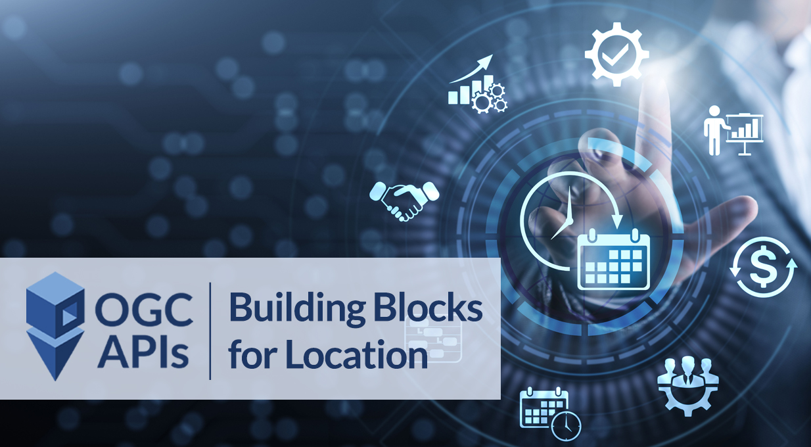

# Conclusão

Esperamos que este workshop tenha fornecido uma visão geral valiosa das muitas funcionalidades da pygeoapi. O objetivo do projeto é facilitar a publicação de dados com baixas barreiras, de forma simples e flexível, utilizando o conjunto de normas das OGC API.

[{ width=40% }](https://pygeoapi.io)

[{ width=40% }](https://ogcapi.ogc.org)

# FOSS4G Europe 2025

Para aqueles que estão a participar no [FOSS4G Europe 2025](https://2025.europe.foss4g.org):

- venham à apresentação sobre o [estado do projeto pygeoapi](https://talks.osgeo.org/foss4g-europe-2025/talk/EPWGP7) na quarta-feira, 16 de julho às 17:45, na sala EL11 (Geosolutions)
- ou às outras apresentações relacionadas com pygeoapi:
- a equipa pygeoapi estará presente no [Community Sprint](https://2025.europe.foss4g.org/schedule/community-sprint/) nos dias 19-20 de julho, no local da conferência, Faculdade de Humanidades e Ciências Sociais (edifício P)

# Contribuições

Sugestões, melhorias e correções são sempre bem-vindas. Por favor, visitem a nossa página da [comunidade](https://pygeoapi.io/community)
para mais informações sobre como entrar em contacto.

Obrigado pelo vosso interesse na pygeoapi!