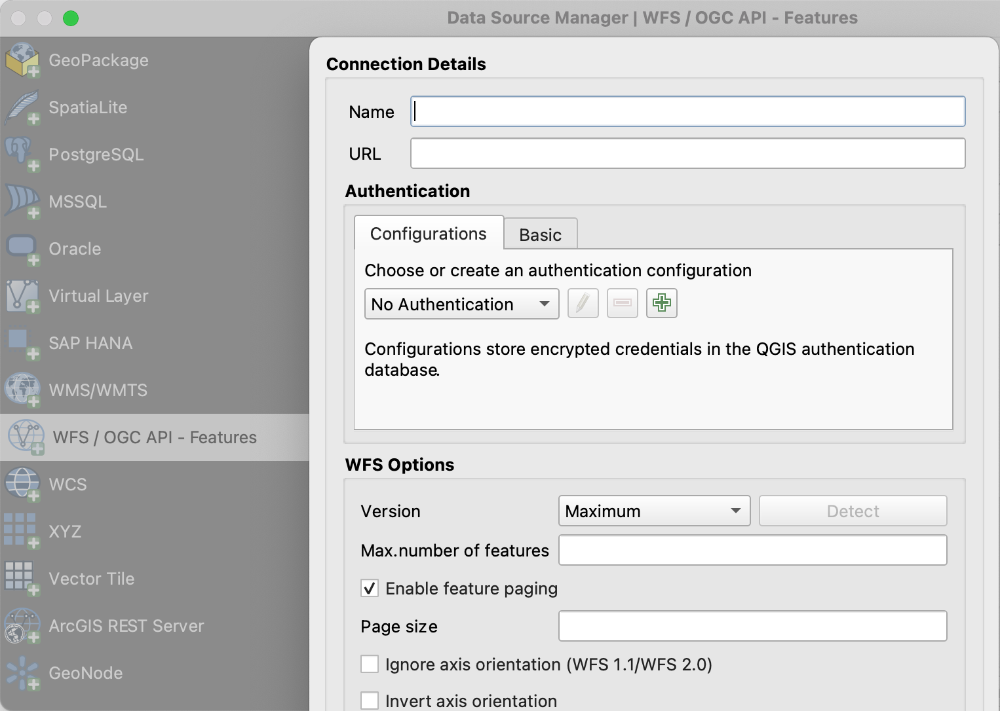
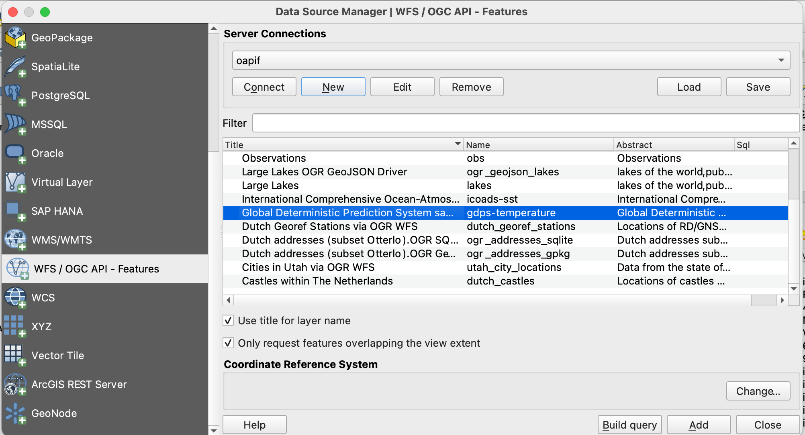

# Exercise 2 - Vector data via OGC API - Features

[OGC API - Features](https://ogcapi.ogc.org/features) provides a Web API to access vector 
data (geometries and their attributes). While the core specification covers basic data access and query,
additional related standards and extensions are in development for the following capabilities:

- [OGC API - Features - Part 1: Core](https://docs.opengeospatial.org/is/17-069r4/17-069r4.html) provides basic access and query capabilities
- [OGC API - Features - Part 2: Coordinate Reference Systems by Reference](https://docs.opengeospatial.org/is/18-058r1/18-058r1.html) enables the import and export of any data according to dedicated projections
- [OGC API - Features - Part 3: Filtering](https://docs.ogc.org/DRAFTS/19-079r1.html) (**draft**) adds the ability for complex queries using Common Query Language (CQL)
- [OGC API - Features - Part 4: Create, Replace, Update and Delete](https://docs.ogc.org/DRAFTS/20-002.html) (**draft**) adds transactional capabilities

## pygeoapi support

pygeoapi supports the core OGC API - Features specification as well as Part 3 for some backends (Elasticsearch).

!!! note

    See [the official documentation](https://docs.pygeoapi.io/en/latest/data-publishing/ogcapi-features.html) for more information on supported vector backends

!!! note

    See [the official documentation](https://docs.pygeoapi.io/en/latest/cql.html) for more information on CQL support 


## Publish a vector dataset

In the previous section we demonstrated the steps involved to add a dataset to pygeoapi and update the configuration. In this excercise we are going to publish another vector file, this time from a [GeoPackage](https://www.geopackage.org) (SQLite3) data source.

!!! tip

    It may be helpful to open the dataset in [QGIS](https://qgis.org) while adding and updating your pygeoapi server to easily evaluate table attributes, names, spatial properties and CRS.


Let's add the file `workshop/docker/data/firenze_terrains.gpkg.zip`:

<div class="termy">
```bash
$ cd workshop/docker/data
$ unzip firenze_terrains.gpkg.zip
```
</div>

!!! question "Update the pygeoapi configuration"

    Open the pygeoapi configuration in a text editor. Add a new dataset section as follows:

    ``` {.yaml linenums="1"}
    firenze-terrains:
        type: collection 
        title: Administrative boundaries before 2014
        description: Cadastral parcels (terrains) from the cadastre. Territory Agency; SIT and Information Networks;
        keywords:  
            - Cadastral parcels
        links:
            - type: text/html
              rel: canonical  
              title: Administrative boundaries before 2014
              href: http://dati.cittametropolitana.fi.it/geonetwork/srv/metadata/cmfi:c539d359-4387-4f83-a6f4-cd546b3d8443
              hreflang: it
        extents:
            spatial: 
                bbox: [11.23,43.75,11.28,43.78] 
                crs: http://www.opengis.net/def/crs/OGC/1.3/CRS84
        providers:
            - type: feature
              name: SQLiteGPKG
              data: /data/firenze_terrains.gpkg # place correct path here
              id_field: fid
              title_field: codbo
              table: firenze_terrains
    ```

Save the file and restart docker compose. Navigate to `http://localhost:5000/collections` to evaluate whether the new dataset has been published.

!!! note

    The SQLite driver incidentally has challenges to open the GeoPackage extension on MacOS. Consult the [official documentation](https://docs.pygeoapi.io/en/latest/development.html#working-with-spatialite-on-osx) or try with an alternative data format.
 
## pygeoapi as a WFS proxy

An interesting use case for pygeoapi is to provide OGC API - Features interface over existing Web Feature Service (WFS) or ESRI FeatureServer endpoints. In this scenario you lower the barrier and increase the usability of existing services to a wider audience. Let's set up an API on top of an existing WFS hosted by the city of Florence.

!!! question "Update the pygeoapi configuration"

    Open the pygeoapi configuration in a text editor. Add a new dataset section as follows:

    ``` {.yaml linenums="1"}
    suol_epicentri_storici:
        type: collection 
        title: Epicenters of the main historical earthquakes
        description: Location of the epicenters of the main historical earthquakes in the territory of the Metropolitan City of Florence classified by year and intensity
        keywords:  
            - earthquakes
        links:
            - type: text/xml
              rel: canonical  
              title: Epicenters of the main historical earthquakes
              href: http://pubblicazioni.cittametropolitana.fi.it/geoserver/territorio/wfs?request=getCapabilities&service=WFS&version=2.0.0
              hreflang: it
        extents:
            spatial: 
                bbox: [10.94, 43.52, 11.65, 44.17] 
                crs: http://www.opengis.net/def/crs/OGC/1.3/CRS84
        providers:
            - type: feature
              name: OGR
              data:
                  source_type: WFS
                  source: WFS:http://pubblicazioni.cittametropolitana.fi.it/geoserver/territorio/wfs?
                  source_srs: EPSG:3003
                  target_srs: EPSG:4326
                  source_capabilities:
                      paging: True
                  source_options:
                      OGR_WFS_LOAD_MULTIPLE_LAYER_DEFN: NO
                  gdal_ogr_options:
                      EMPTY_AS_NULL: NO
                      GDAL_CACHEMAX: 64
                      CPL_DEBUG: NO
              id_field: cpti_id
              title_field: d
              layer: territorio:suol_epicentri_storici
    ```

Save the file and restart docker compose. Navigate to `http://localhost:5000/collections` to evaluate whether the new dataset has been published.

## Client access

### QGIS

QGIS is one of the first GIS Desktop clients which added support for OGC API - Features. Support has been integrated into the existing WFS provider.

!!! question "Open an OGC API - Features collection in QGIS"

    Follow the steps to add some collections from an OGC API - Features enpoint: 

    - Open QGIS (if you don't have QGIS, you can use OSGeoLive)
    - From the Layer menu, select `Add Layer` > `Add WFS layer`
    - From the `Data source manager` panel, choose 'New connection'
    
    { width=50% }
    
    - Add the URL https://demo.pygeoapi.io/master (or the address of a local server)
    - You can now click the `detect` button and QGIS will notice you are configuring an OGC API - Features endpoint
    - QGIS facilitates to set page size (request is split in multiple requests)
        - for points you can easily set it to 2500
        - for some polygons with high density, 100 can already be slow
    - Press `OK` to save the connection and return to the previous screen
    - Now click the `Connect` button to retireve the collections of the service
    
    { width=50% }
    
    - You can now add collections to your QGIS project
    - You can also build a query to add a subset of the collection
    - Close the `Data source manager`. Notice that QGIS applied a default styling just like it would if you add a file based layer. You can work with the collection in a similar way; identify, apply styling, filter, export, etc.


!!! tip

    Install and activate the `QGIS Network Logger` extension. It will display HTTP traffice within QGIS and is a valuable tool in debugging failing connections.

!!! note

    An increasing number of GIS Desktop clients add support for OGC API's in subsequent releases. For example ArcGIS Pro [supports OGC API - Features](https://pro.arcgis.com/en/pro-app/2.8/help/data/services/use-ogc-api-services.htm) since release 2.8.

### GDAL/OGR

[GDAL/OGR](https://gdal.org) provides support for [OGC API - Features](https://gdal.org/drivers/vector/oapif.html). This means you can use `ogrinfo`, `ogr2ogr` to query and convert data from OGC API - Features endpoints just like any other vector data source.  This also means you can make connections to OGC API - Features endpoints from any software which has an interface to GDAL, such as MapServer, GeoServer, Manifold, FME, ArcGIS, etc.

!!! question "Use OGR to interact with OGC API - Features"

    - Verify you have a recent GDAL installed, else use GDAL from OSGeoLive
    - Run `ogrinfo` on the command line to verify a connection to OGC API - Features

    <div class="termy">
    ```bash
    $ ogrinfo OAPIF:https://demo.pygeoapi.io/master/collections/obs
    ```
    </div>
    
    Now, let's convert the observations into a shapefile

    <div class="termy">
    ```bash
    $ ogr2ogr -f "ESRI Shapefile" obs.shp OAPIF:https://demo.pygeoapi.io/master/collections/obs
    ```
    </div>

!!! Note

    You can even use OGR to append new features to an OGC API - Features collection which supports transactions (pygeoapi transaction support is planned for future implementation)

### OWSlib

[OWSlib](https://geopython.github.io/OWSLib) is a Python library to interact with OGC Web Services and supports a number of OGC APIs including OGC API - Features.

!!! question "Interact with OGC API - Features via OWSLib"

    If you do not have Python installed, consider running this exercise in a Docker container or in a cloud environment.

    <div class="termy">
    ```bash
    $ pip3 install owslib
    ```
    </div>

    Then start a Python console session with: `python` (stop the session by typing `exit()`).

    <div class="termy">
    ```python
    >>> from owslib.ogcapi.features import Features
    >>> w = Features('https://demo.pygeoapi.io/master')
    >>> w.url
    'https://demo.pygeoapi.io/master'
    >>> conformance = w.conformance()
    {u'conformsTo': [u'http://www.opengis.net/spec/ogcapi-features-1/1.0/conf/core', u'http://www.opengis.net/spec/ogcapi-features-1/1.0/conf/oas30', u'http://www.opengis.net/spec/ogcapi-features-1/1.0/conf/html', u'http://www.opengis.net/spec/ogcapi-features-1/1.0/conf/geojson']}
    >>> api = w.api()  # OpenAPI document/
    >>> collections = w.collections()
    >>> len(collections['collections'])
    13
    >>> feature_collections = w.feature_collections()
    >>> len(feature_collections)
    13
    >>> lakes = w.collection('lakes')
    >>> lakes['id']
    'lakes'
    >>> lakes['title']
    'Large Lakes'
    >>> lakes['description']
    'lakes of the world, public domain'
    >>> lakes_queryables = w.collection_queryables('lakes')
    >>> len(lakes_queryables['queryables'])
    6
    >>> lakes_query = w.collection_items('lakes')
    >>> lakes_query['features'][0]['properties']
    {u'scalerank': 0, u'name_alt': None, u'admin': None, u'featureclass': u'Lake', u'id': 0, u'name': u'Lake Baikal'}
    ```
    </div>

!!! note

    See the official [OWSLib documentation](https://geopython.github.io/OWSLib/usage.html#ogc-api) for more examples.

# Summary

Congratulations! You are now able to publish vector data to pygeoapi.
