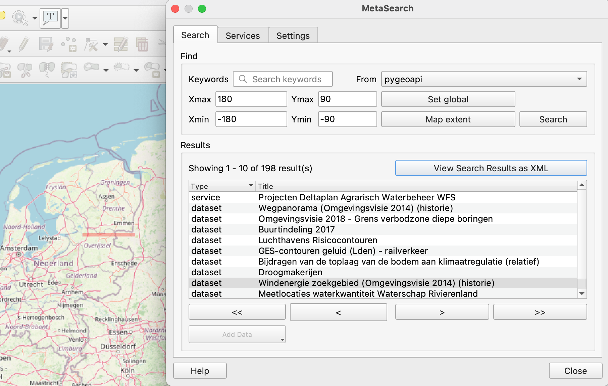

# Metadata

[OGC API Records](https://ogcapi.ogc.org/records/) provides access to repositories of metadata records. 
The API definition is likely to be adopted by OGC soon. pygeoapi contains an early implementation of the standard. 


## Publish a set of metadata records in pygeoapi

With pygeoapi we can setup an OGC API Record using any data provider. In this example we will use [TinyDB](https://tinydb.readthedocs.io/en/latest/index.html).

To use the example database *workshop/docker/data/records/catalogue.tinydb* we must configure it in `docker.config.yml` with following configuration:

``` {.yaml linenums="1"}
    example_catalog:
        type: collection
        title: FOSS4G Florence Record catalog
        description: FOSS4G Florence Record catalog (OGC API Records)
        keywords:
            - Services
            - Infrastructures
            - Florence
            - FOSS4G
        links:
            - type: text/html
              rel: canonical
              title: information
              href: http://opendata.comune.firenze.it
              hreflang: en-US
        extents:
            spatial:
                bbox: [11.145, 43.718, 11.348, 43.84]
                crs: http://www.opengis.net/def/crs/OGC/1.3/CRS84
        providers:
            - type: record
              name: TinyDBCatalogue
              data: ../data/records/catalogue.tinydb
              id_field: externalId
              time_field: recordCreated
              title_field: title
```
Then restast the instance.

It's possible to load more example ISO19139 metadata in a TinyDB database with [this script](https://raw.githubusercontent.com/geopython/pygeoapi/master/tests/load_tinydb_records.py)

``` {.bash linenums="1"}
python3 load_tinydb_records.py /xml_folder/ /db_folder/sample-records.tinydb
```

## Client Access

QGIS supports OGC API Records via the [Metasearch plugin](https://docs.qgis.org/latest/en/docs/user_manual/plugins/core_plugins/plugins_metasearch.html). Metasearch originally focused on Catalogue Service for the Web (OGC:CSW) only, but has been extended to OGC API Records last year. Metasearch is a default plugin in QGIS (no installation required).

!!! question "Query OGC API Records from QGIS"

    Follow these steps to connect to a service and query datasets:

    - Locate the metasearch plugin in the web menu or on a toolbar (globe + binoculars). The main search panel opens with some popular catalogues pre-populated.

    { width=50% }

    - Open the `services` tab, to find the `new` button to create a new connection.
    - Add a connection to `https://demo.pygeoapi.io/master`.
    - Click `Serviceinfo` to get information about the service.
    - Return to the Search tab.
    - Select the connection you have just created.
    - type a search term and click `search`.
    - Notice that when you select a search result, a red box is drawn on the map highlighting the location of the dataset.

    { width=50% }

!!! note

    In optimal cases Metasearch will locate a file or service link on the metadata and enable the `add data` button (like it does for CSW). Unfortunately the OGC group is still discussing how to implement this in the standard. OGC API Records is not final yet, so its functionality may be subject to change.
