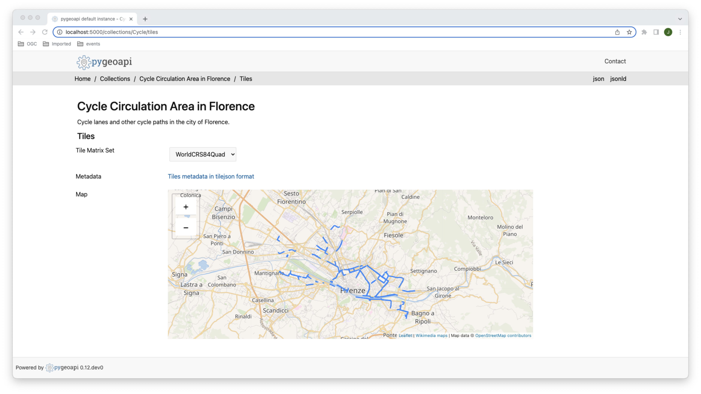
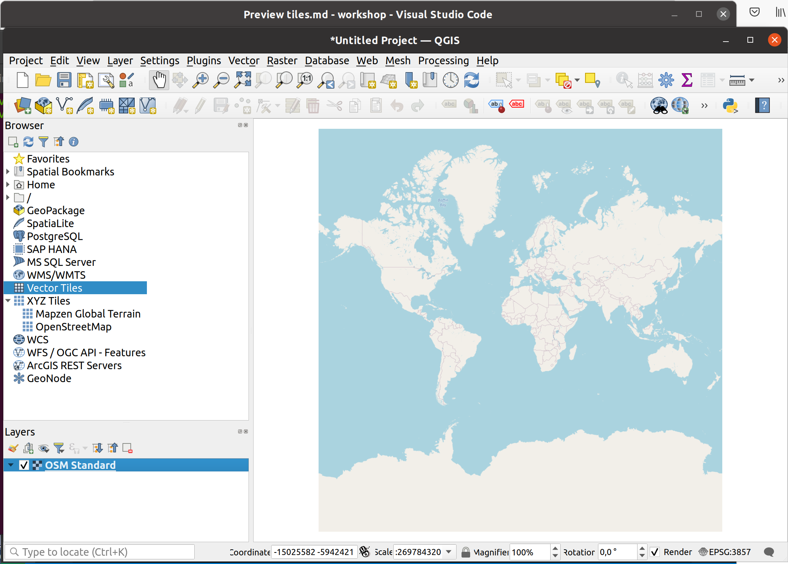
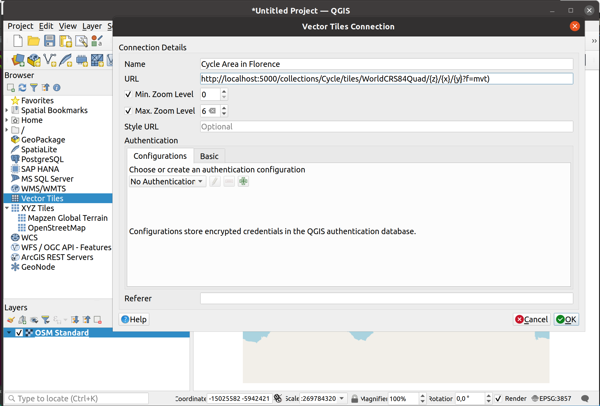
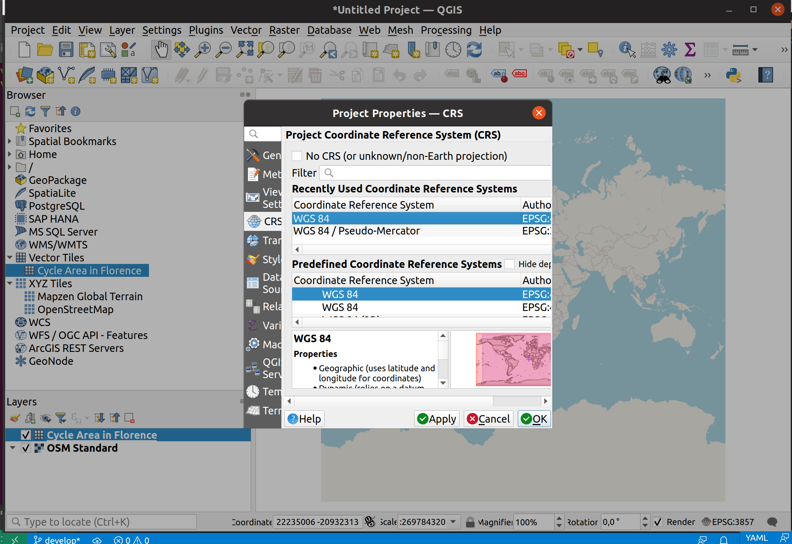
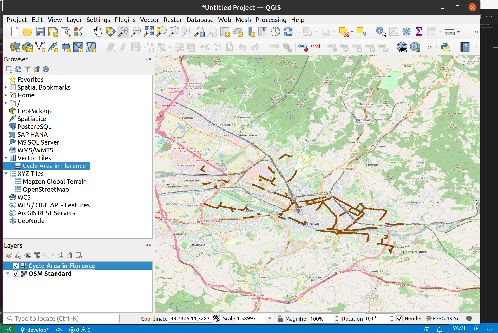

# Tiles of geospatial information

On  this section, you will learn how to publish and consume vector tiles using the [OGC API - Tiles](https://github.com/opengeospatial/ogcapi-tiles) candidate standard.

[OGC API Tiles](https://ogcapi.ogc.org/tiles/) offers a standardised API for accessing repositories 
of tiled imagery. Either in bitmap or vector format.

OGC API Tiles extends the collection/* url structure. In stead of items, the tilesets are listed under 
collection/example/tiles/*, eg.

```
https://demo.pygeoapi.io/collections/lakes/tiles/WorldCRS84Quad/{tileMatrix}/{tileRow}/{tileCol}?f=mvt
```

pygeoapi is able to advertise an existing tileset as OGC API Tiles. pygeoapi itself does not render 
tiles from source data. Use [tilemill](https://tilemill-project.github.io/tilemill/), 
[Mapproxy](https://mapproxy.org/) or 
[QGIS](https://www.qgistutorials.com/en/docs/creating_basemaps_with_qtiles.html) to generate the tileset.

Notice that the OGC API Tiles url structure is compatible with XYZ layers in common libraries, 
such as OpenLayers, Leaflet and MapML.

## Publish a tile dataset

For this exercise, you will publish a vector dataset of cycle paths, from the city of Florence.

* data:  `../../../docker/data/cycle-lanes-firenze.geojson`
* metadata:  `../../../docker/data/cycle-lanes-firenze.qmd`

Change to docker directory:

```
cd workshop/docker
```

Generate vector tiles on disk, using [tippecanoe](https://github.com/mapbox/tippecanoe):

```
docker run -it --rm \
  -v ${PWD}/data:/data \
  emotionalcities/tippecanoe \
tippecanoe --output-to-directory=/data/tiles/ --force --maximum-zoom=16 --drop-densest-as-needed --extend-zooms-if-still-dropping --no-tile-compression /data/cycle-lanes-firenze.geojson
```

Add the cycle collection to the ```resources``` section of docker.config.yml:

``` {.yaml linenums="1"}
    Cycle:
        type: collection
        title: Cycle Circulation Area in Florence 
        description: Cycle lanes and other cycle paths in the city of Florence.
        keywords:
            - cycle
        links:
            - type: text/html
              rel: canonical
              title: information
              href: http://opendata.comune.firenze.it/?q=metarepo/datasetinfo&id=52d8d3ab-eae5-400e-8561-d974f8612de0
              hreflang: en-US
        extents:
            spatial:
                bbox: [-180,-90,180,90]
                crs: http://www.opengis.net/def/crs/OGC/1.3/CRS84
            temporal:
                begin: 2011-11-11
                end: null  # or empty
        providers:
            - type: feature
              name: GeoJSON
              data: /data/cycle-lanes-firenze.geojson
              #id_field: field_1
            - type: tile
              name: MVT
              data: /data/tiles
              #data: tests/data/tiles/DATASET
              options:
                metadata_format: tilejson # default | tilejson
                bounds: [[11.1861935050234251,43.7512761718001855],[11.3125196304517655,43.8129406631082645]]
                zoom:
                    min: 0
                    max: 16
                schemes:
                    - WorldCRS84Quad
              format:
                    name: pbf
                    mimetype: application/vnd.mapbox-vector-tile
```

Start pygeoapi with:
```
docker-compose up
```

You can access the ```Cycle``` collection at this endpoint:

[http://localhost:5000/collections/Cycle](http://localhost:5000/collections/Cycle
)

And the tile metadata at this endpoint:

[http://localhost:5000/collections/Cycle/tiles/WorldCRS84Quad/metadata](http://localhost:5000/collections/Cycle/tiles/WorldCRS84Quad/metadata)



## Client Access

!!! question "Access OGC API Vector Tiles from QGIS"

    QGIS supports OGC API Vector Tiles via the [Vector Tiles Layer](https://docs.qgis.org/3.22/en/docs/user_manual/working_with_vector_tiles/vector_tiles_properties.html). Although OGC API Tiles are not natively supported, you can customize the `generic connection` in order to access them in QGIS.

    Before entering QGIS, access your pygeoapi installation page on the browser and follow these steps.

    - Access the collection page of the tiles dataset: http://localhost:5000/collections/Cycle
    - From there, navigate to the tiles page by clicking on `tiles`: http://localhost:5000/collections/Cycle/tiles
    - Click in `Tiles metadata in tilejson format`: http://localhost:5000/collections/Cycle/tiles/WorldCRS84Quad/metadata
    - Take note of the url in `tiles`: `http://localhost:5000/collections/Cycle/tiles/WorldCRS84Quad/{tileMatrix}/{tileRow}/{tileCol}?f=mvt)` and of the values of minZoom and maxZoom.

    Follow these steps to connect to a service and access vector tiles:

    - Locate the vector tiles service, on the left hand side browser panel. In alternative, you can also go to the top menu and navigate to Layer->Add Layer->Vector Tile Layer.

    { width=100% }

    - Right-click to bring up the context menu and choose `New Generic connection`.  
    - Fill the required values. For URL, use the one you noted from the previous step, replacing the`{tileMatrix}/{tileRow}/{tileCol}` by {x}/{x}/{y}. 
    - Press `Ok` to add the service. At this point, if you are using the browser you should see the collection appearing in the menu, bellow "Vector Tiles".
    - Double-click in the collection to add it to the map. 
    - Don't forget to set the CRS of the map to `EPSG:4326`, by clicking in the button on the lower right corner. 
    - Zoom in to Florence, to see your dataset.

    { width=100% }
    { width=100% }
    { width=100% }

[LeafletJS](https://leafletjs.com) is a popular javascript library to add interactive maps to websites. LeafletJS does not support OGC API's explicitely, leafletJS can however interact with OGC API by using the results of the API directly.

!!! question "Add OGC API Tiles to a website with LeafletJS"

    Copy the html below to a file called 'vector-tiles.html', or locate this file on folder `./workshop/html` . Open the file in a web browser.
    The code uses the LeafletJS library with the [leaflet.vectorgrid](https://github.com/Leaflet/Leaflet.VectorGrid) plugin to display the lakes OGC API Tile service on top of an Open Street Map background.

    ``` {.html linenums="1"}
    <html>
    <head><title>OGC API Tiles exercise</title></head>
    <body>
    <div id="map" style="width:100vw;height:100vh;"></div>
    <link rel="stylesheet" href="https://unpkg.com/leaflet@1.0.3/dist/leaflet.css" />
    <script type="text/javascript" src="https://unpkg.com/leaflet@1.3.1/dist/leaflet.js"></script>
    <script type="text/javascript" src="https://unpkg.com/leaflet.vectorgrid@1.2.0"></script>
    <script>
    map = L.map('map').setView({ lat: 43.79, lng: 11.25 }, 12);
    map.addLayer(
        new L.tileLayer('https://stamen-tiles-{s}.a.ssl.fastly.net/watercolor/{z}/{x}/{y}.{ext}', {
        attribution: 'Map tiles by <a href="http://stamen.com">Stamen Design</a>, <a href="http://creativecommons.org/licenses/by/3.0">CC BY 3.0</a> &mdash; Map data &copy; <a href="https://www.openstreetmap.org/copyright">OpenStreetMap</a> contributors',
        subdomains: 'abcd',
        minZoom: 1,
        maxZoom: 16,
        ext: 'jpg'
        }));
    map.addLayer(new L.vectorGrid.protobuf(
        'http://localhost:5000/collections/Cycle/tiles/WorldCRS84Quad/{z}/{x}/{y}?f=mvt', 
        { rendererFactory: L.canvas.tile }));
    </script>
    </body>
    </html>
    ```

   { width=100% }

!!! tip 
    Try adding a [different pygeoapi vector tiles layer](https://demo.pygeoapi.io/master/collections/lakes/tiles/WorldCRS84Quad/metadata), by updating the code on 'vector-tiles.html'.

!!! tip 

    Openlayers is another javascript library with support for OGC API Tiles. Check out their [vector tile example](https://openlayers.org/en/latest/examples/ogc-vector-tiles.html).
