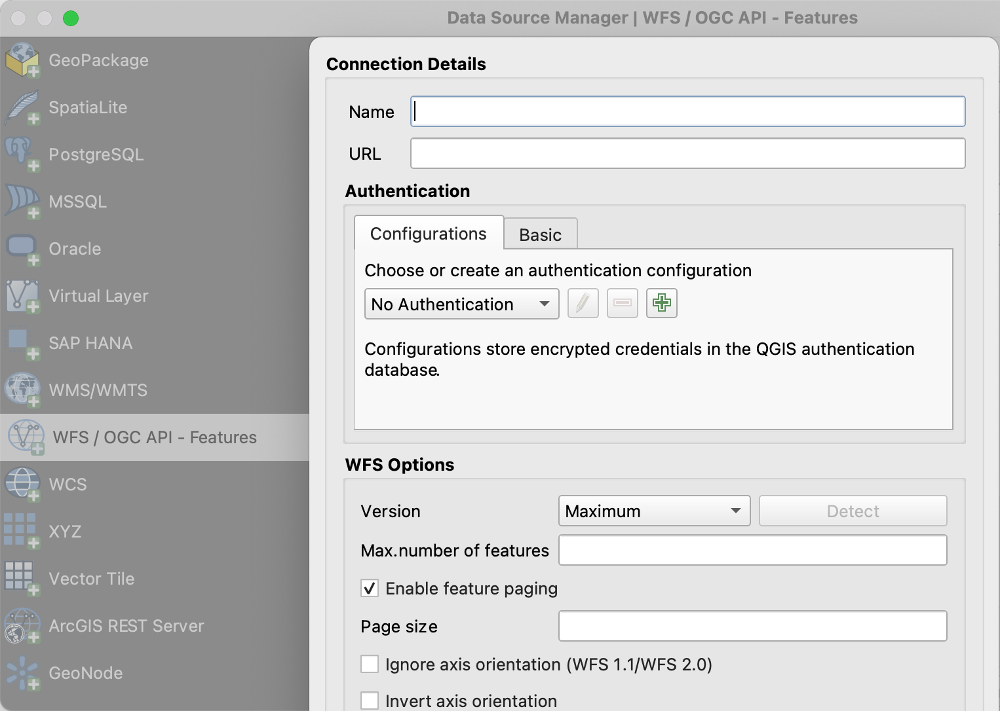
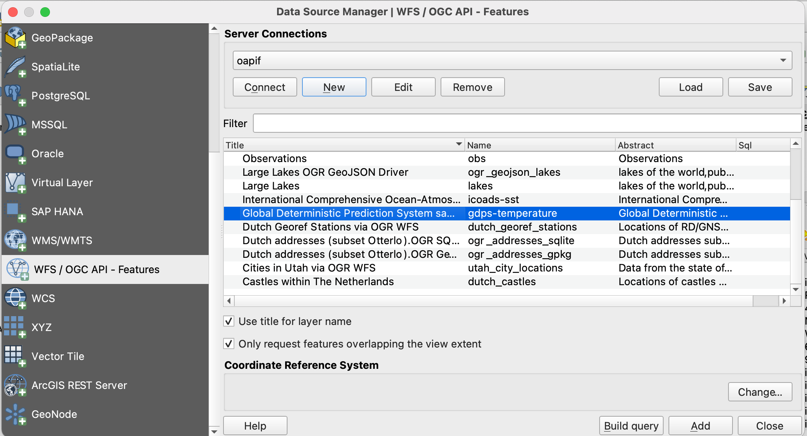

# Vector Data


## Client Access

QGIS is one of the first GIS Desktop clients which added support for OGC API Features. The support has been integrated into the WFS connection panel.

!!! question "Open an OGC API Features collection in QGIS"

    Follow the steps to add some collections from an OGC API Features enpoint: 

    - Open QGIS (if you don't have QGIS, you can use OSGEO Live). 
    - From the Layer menu, select `Add Layer` > `Add WFS layer`. 
    - From the `Data source manager` panel, choose 'New connection'. 
    
    { width=50% }
    
    - Add the URL https://demo.pygeoapi.io/master (or the address of a local server). 
    - You can now click the `detect` button and QGIS will notice you are configuring an OGC API Features endpoint. 
    - QGIS facilitates to set page size (request is split in multiple requests), for points you can easily set it to 2500, for certain polygons 100 can already be slow. 
    - Press `ok` to save the connection and return to the previous screen. 
    - Now click the `Connect` button to retireve the collections of the service. 
    
    { width=50% }
    
    - You can now add collections to your QGIS project. 
    - You can also build a query to add a subset of the collection.
    - Close the `Data source manager`. Notice that QGIS applied a default styling just like it would if you add a file based layer. You can work with the collection in a similar way; identify, apply styling, filter, export, etc.  


    
!!! tip

    Install and activate the `QGIS Network Logger` extension. It will display which web requests are fired on the backend, also a good tool to debug failing connections.

!!! note

    An increasing number of GIS Desktop clients add support for OGC API's in subsequent releases. For example ArcGIS Pro [supports OGC API Features](https://pro.arcgis.com/en/pro-app/2.8/help/data/services/use-ogc-api-services.htm) since release 2.8.


[GDAL/OGR](https://gdal.org) provides mechanisms to interact with [OGC API Features](https://gdal.org/drivers/vector/oapif.html) as well as [OGC API Coverages](https://gdal.org/drivers/raster/ogcapi.html). It means you can use the popular client commands to interact with OGC API's; ogrinfo, gdalinfo, ogr2ogr, etc. Also you can make connections to OGC API's from any software which has an interface to gdal, such as Mapserver, GeoServer, Manifold, FME, ArcGIS, etc.

!!! question "Use OGR to interact with OGC API Features"

    - Verify you have a recent GDAL installed, else use GDAL from OSGEO Live.
    - Run OGRINFO on command line to verify a connection to OGC API Features

    ```
    ogrinfo OAPIF:https://demo.pygeoapi.io/master/collections/obs
    ```
    
    - Now, let's convert the observations into a shapefile

    ```
    ogr2ogr\
      -f "ESRI Shapefile" obs.shp\
      OAPIF:https://demo.pygeoapi.io/master/collections/obs
    ```

!!! Note

    You can even use OGR to append new features to an OGC API Features collection. However at this moment in time pygeoapi does not support transactions yet.

[OWSlib](https://geopython.github.io/OWSLib/) is a python library to interact with OGC services. Recently support for OGC API Features, Records and Coverages has been added.

!!! question "Interact with OGC API Features from python"

    If you do not have python installed, consider to run this exercise in a docker container or in a cloud environment. From console install owslib:
    
    ```
    pip install owslib
    ```

    Then start a python console session with: `python` (stop the session by typing `exit()`).

    ```python
    >>> from owslib.ogcapi.features import Features
    >>> w = Features('https://demo.pygeoapi.io/master')
    >>> w.url
    'https://demo.pygeoapi.io/master'
    >>> conformance = w.conformance()
    {u'conformsTo': [u'http://www.opengis.net/spec/ogcapi-features-1/1.0/conf/core', u'http://www.opengis.net/spec/ogcapi-features-1/1.0/conf/oas30', u'http://www.opengis.net/spec/ogcapi-features-1/1.0/conf/html', u'http://www.opengis.net/spec/ogcapi-features-1/1.0/conf/geojson']}
    >>> api = w.api()  # OpenAPI document/
    >>> collections = w.collections()
    >>> len(collections['collections'])
    13
    >>> feature_collections = w.feature_collections()
    >>> len(feature_collections)
    13
    >>> lakes = w.collection('lakes')
    >>> lakes['id']
    'lakes'
    >>> lakes['title']
    'Large Lakes'
    >>> lakes['description']
    'lakes of the world, public domain'
    >>> lakes_queryables = w.collection_queryables('lakes')
    >>> len(lakes_queryables['queryables'])
    6
    >>> lakes_query = w.collection_items('lakes')
    >>> lakes_query['features'][0]['properties']
    {u'scalerank': 0, u'name_alt': None, u'admin': None, u'featureclass': u'Lake', u'id': 0, u'name': u'Lake Baikal'}
    ```
