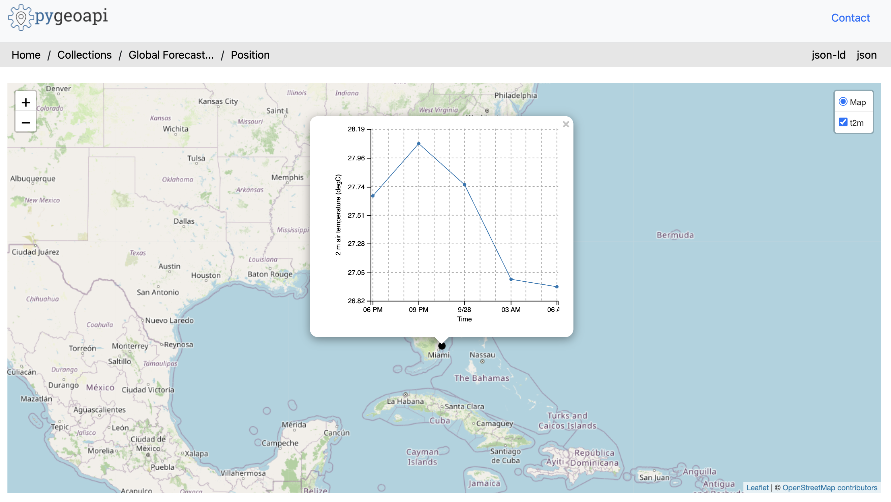
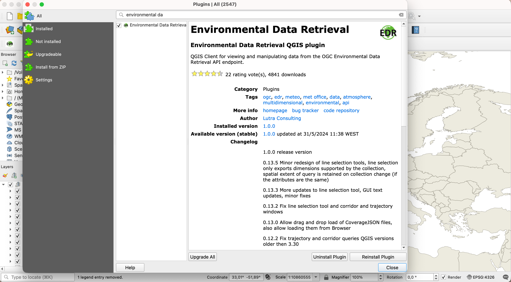
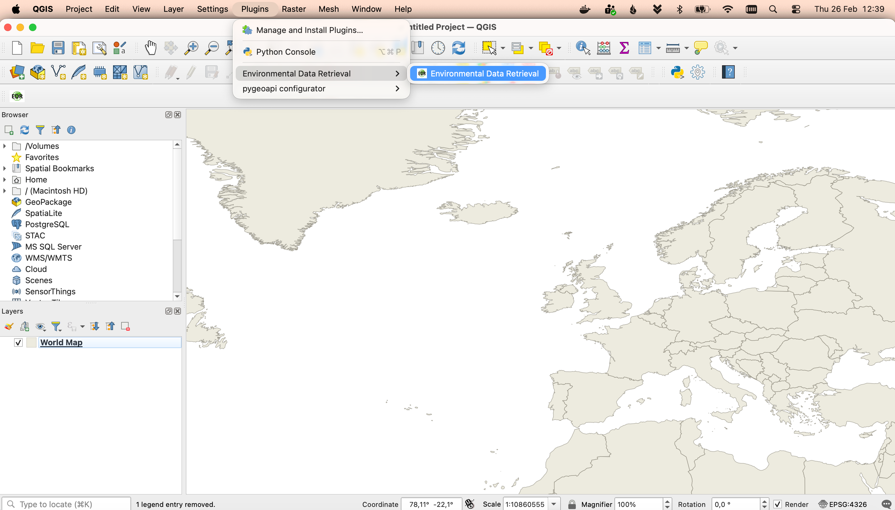

# Exercise 7 - Environmental data via OGC API - Environmental Data Retrieval

[OGC API - Environmental Data Retrieval](https://ogcapi.ogc.org/edr) provides a Web API to access
environmental data using well defined query patterns:

* [OGC API - Environmental Data Retrieval Standard](https://docs.ogc.org/is/19-086r4/19-086r4.html)

OGC API - Environmental Data Retrieval uses OGC API - Features as a building block, thus enabling
streamlined integration for clients and users.  EDR can be considered a convenience API which does
not require in depth knowledge about the underlying data store/model.

## pygeoapi support

pygeoapi supports the OGC API - Environmental Data Retrieval specification by leveraging both feature
and coverage provider plugins.

!!! note

    See [the official documentation](https://docs.pygeoapi.io/en/latest/publishing/ogcapi-edr.html) for more information on supported EDR backends


## Publish environmental data in pygeoapi

Let's try publishing sample [weather forecast model data](https://www.ncei.noaa.gov/products/weather-climate-models/global-forecast) from NOAA via the EDR xarray plugin. The sample data can be found in `workshop/exercises/data/gfs_tmp2m.zarr`:


!!! question "Update the pygeoapi configuration"

    Open the pygeoapi configuration file in a text editor. Add a new dataset section as follows:

``` {.yaml linenums="1"}
    noaa-gfs:
        type: collection
        title: Global Forecast System (GFS), 2 metre air temperature
        description: Global Forecast System (GFS), 2 metre air temperature
        keywords:
            - gfs
            - forecast
            - air temperature
        extents:
            spatial:
                bbox: [-128,23,-65,50]
                crs: http://www.opengis.net/def/crs/OGC/1.3/CRS84
            temporal:
                begin: 2023-09-27T18:00:00Z
                end: 2023-09-28T06:00:00Z
        links:
            - type: text/html
              rel: canonical
              title: information
              href: https://www.ncei.noaa.gov/products/weather-climate-models/global-forecast
              hreflang: en-US
        providers:
            - type: edr
              name: xarray-edr
              data: /data/gfs_tmp2m.zarr
              x_field: lon
              y_field: lat
              time_field: time
              format:
                  name: zarr
                  mimetype: application/zip
```

Save the configuration and restart Docker Compose. Navigate to <http://localhost:5000/collections> to evaluate whether the new dataset has been published.

At first glance, the Global Forecast System (GFS), 2 metre air temperature (`noaa-gfs`) collection appears as a normal OGC API collection. Look a bit closer at the collection description (<http://localhost:5000/collection/noaa-gfs>), and notice the "Data Queries" and "Parameters" sections (add `f=json` to the collection description URL to inspect the additional EDR specific elements such as `data_queries` and `parameter_names` various JSON elements).  The "Parameters" section describes the environmental parameters associated with the collection which can be used as part of a collection query.

Try visualizing the following EDR position query (focused on Fort Lauderdale, USA) in a web browser: <http://localhost:5000/collections/noaa-gfs/position?coords=POINT(-80.1373%2026.1224)>.  Note the interactive graph displaying the time series of 2 metre temperature data.

{ width=100% }

## Client access

### QGIS

[QGIS](https://qgis.org/) supports OGC API - EDR via the [EDR plugin](https://plugins.qgis.org/plugins/edr_plugin/). You can install the plugin directly from the QGIS Plugin Hub, by going to `Plugins->Manage and Install Plugins` on the top level menu.

{ width=100% }

You can access the plugin through an entry on the plugin menu.

{ width=100% }

### OWSLib - Advanced

[OWSLib](https://owslib.readthedocs.io) is a Python library to interact with OGC Web Services and supports a number of OGC APIs including OGC API - Environmental Data Retrieval.

!!! question "Interact with OGC API - Environmental Data Retrieval via OWSLib"

    If you do not have Python installed, consider running this exercise in a Docker container. See the [Setup Chapter](../setup.md#using-docker-for-python-clients).

    === "Linux/Mac"

        ```bash
        pip3 install owslib
        ```

    === "Windows (PowerShell)"

        ```bash
        pip3 install owslib
        ```

    Then start a Python console session with `python3` (stop the session by typing `exit()`).

    === "Linux/Mac"

        ```python
        >>> from owslib.ogcapi.edr import  EnvironmentalDataRetrieval
        >>> w = EnvironmentalDataRetrieval('https://demo.pygeoapi.io/master')
        >>> w.url
        'https://demo.pygeoapi.io/master'
        >>> api = w.api()  # OpenAPI document
        >>> collections = w.collections()
        >>> len(collections['collections'])
        13
        >>> noaa_gfs = w.collection('noaa-gfs')
        >>> noaa_gfs['parameter_names'].keys()
        dict_keys(['t2m'])
        >>> data = w.query_data('noaa-gfs', 'position', coords='POINT(-80.1373 26.1224)', parameter_names=['t2m'])
        >>> data  # CoverageJSON data
        ```

    === "Windows (PowerShell)"

        ```python
        >>> from owslib.ogcapi.edr import  EnvironmentalDataRetrieval
        >>> w = EnvironmentalDataRetrieval('https://demo.pygeoapi.io/master')
        >>> w.url
        'https://demo.pygeoapi.io/master'
        >>> api = w.api()  # OpenAPI document
        >>> collections = w.collections()
        >>> len(collections['collections'])
        13
        >>> noaa_gfs= w.collection('noaa-gfs')
        >>> noaa_gfs['parameter_names'].keys()
        dict_keys(['t2m'])
        >>> data = w.query_data('noaa-gfs', 'position', coords='POINT(-80.1373 26.1224)', parameter_names=['t2m'])
        >>> data  # CoverageJSON data
        ```

!!! note

    See the official [OWSLib documentation](https://owslib.readthedocs.io/en/latest/usage.html#ogc-api) for more examples.

# Summary

Congratulations!  You are now able to publish environmental data to pygeoapi.
