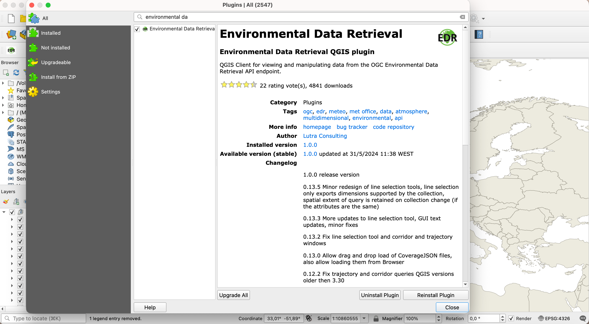
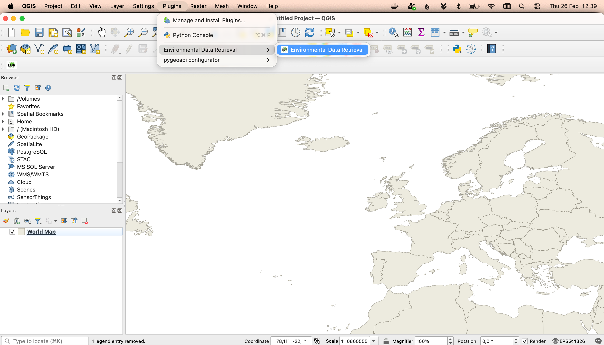
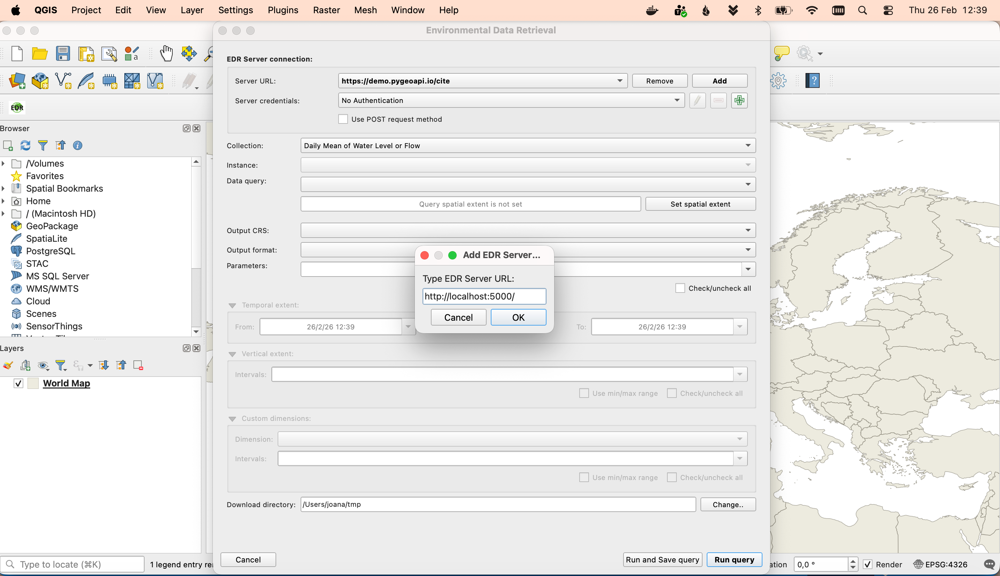
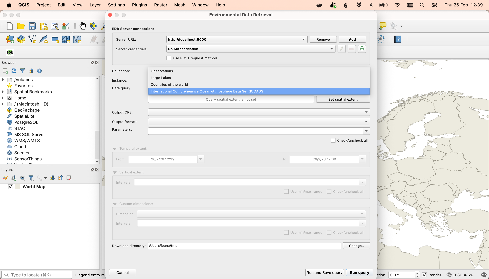
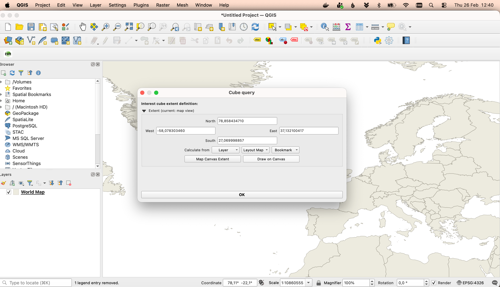
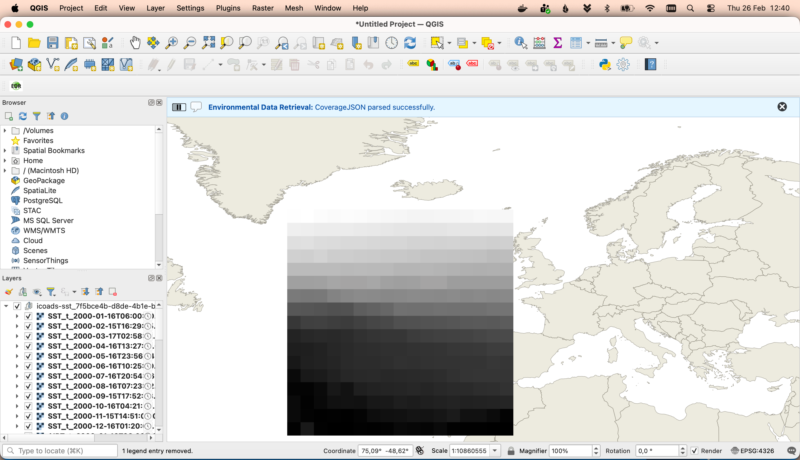

# Exercício 7 - Dados ambientais via OGC API - Environmental Data Retrieval

[OGC API - Environmental Data Retrieval](https://ogcapi.ogc.org/edr) fornece uma Web API para aceder
a dados ambientais usando padrões de consulta bem definidos:

* [Norma OGC API - Environmental Data Retrieval](https://docs.ogc.org/is/19-086r4/19-086r4.html)

A OGC API - Environmental Data Retrieval utiliza a OGC API - Features como bloco de construção, permitindo assim
integração simplificada para clientes e utilizadores. A EDR pode ser considerada uma API de conveniência que não
requer conhecimento aprofundado sobre o armazenamento/modelo de dados subjacente.

## Suporte na pygeoapi

A pygeoapi suporta a especificação OGC API - Environmental Data Retrieval aproveitando tanto plugins de fornecedor
de funcionalidades como de cobertura.

!!! note

    Consulte [a documentação oficial](https://docs.pygeoapi.io/en/latest/data-publishing/ogcapi-edr.html) para mais informações sobre backends EDR suportados


## Publicar dados ambientais na pygeoapi

Vamos publicar alguns dados ICOADS através do plugin EDR xarray. Os dados ICOADS do exemplo podem ser encontrados em `workshop/exercises/data/coads_sst.nc`:


!!! question "Atualizar a configuração da pygeoapi"

    Abra o ficheiro de configuração da pygeoapi num editor de texto. Adicione uma nova secção de conjunto de dados da seguinte forma:

``` {.yaml linenums="1"}
    icoads-sst:
        type: collection
        title: International Comprehensive Ocean-Atmosphere Data Set (ICOADS)
        description: International Comprehensive Ocean-Atmosphere Data Set (ICOADS)
        keywords:
            - icoads
            - sst
            - air temperature
        extents:
            spatial:
                bbox: [-180,-90,180,90]
                crs: http://www.opengis.net/def/crs/OGC/1.3/CRS84
            temporal:
                begin: 2000-01-16T06:00:00Z
                end: 2000-12-16T06:00:00Z
        links:
            - type: text/html
              rel: canonical
              title: information
              href: https://psl.noaa.gov/data/gridded/data.coads.1deg.html
              hreflang: en-US
        providers:
            - type: edr
              name: xarray-edr
              data: /data/coads_sst.nc
              format:
                  name: NetCDF
                  mimetype: application/x-netcdf
```

Guarde a configuração e reinicie o Docker Compose. Navegue para <http://localhost:5000/collections> para avaliar se o novo conjunto de dados foi publicado.

À primeira vista, a coleção `icoads-sst` aparece como uma coleção normal OGC API - Coverages. Olhe um pouco mais de perto para a descrição da coleção, e note
que há uma chave 'parameter_names' que descreve os nomes dos parâmetros EDR para as consultas da coleção.

## Acesso do lado do cliente

### QGIS

O [QGIS](https://qgis.org/) dá suporte à OGC API - EDR através do [plugin EDR](https://plugins.qgis.org/plugins/edr_plugin/). Pode instalar-lo directamente através do Hub de plugins do QGIS, indo a `Plugins->Gerir e instalar Plugins` no menu de topo.

{ width=100% }

Pode aceder ao plugin através de uma entrada no menu de plugins.

{ width=100% }

A primeira coisa a fazer é configurar o url do servidor. Use aqui o url da Landing Page: `http://localhost:5000/`

!!! tip "Também deveria comecar por definir a directoria onde gostaria de guardar os dados descarregados pelo plugin"

{ width=100% }

A combo box será populada com todas as coleções disponiveis naquele servidor. Seleccione a coleção EDR: `International Comprehensive Ocean-Atmosphere Data Set (ICOADS)`.

!!! tip "Pode ignorar os avisos mostrados aqui!"

{ width=100% }

A combo box de query de dados será populada com os tipos de query de dados disponiveis para esta coleção, neste caso: posição e cubo. Pode seleccionar a query do tipo cubo e carregar no botão que permite definir a extensão espacial da query. Um novo diálogo irá abrir, mostrando as diferentes opções para definir a extensão espacial. Pode escolher `Desenhar no canvas`, para desenhar um rectângulo no extent da map view.

{ width=100% }

Pode fechar este dialogo e executar a query. O plugin irá descarregar todos os dados disponiveis que se encaixam nesta query e mostrar-los como um grupo de layers.

{ width=100% }

### OWSLib - Avançado

[OWSLib](https://owslib.readthedocs.io) é uma biblioteca Python para interagir com Serviços Web OGC e suporta várias OGC APIs incluindo OGC API - Environmental Data Retrieval.

!!! question "Interagir com OGC API - Environmental Data Retrieval via OWSLib"

    Se não tem Python instalado, considere executar este exercício num contentor Docker. Consulte o [Capítulo de Configuração](../setup.md#using-docker-for-python-clients).

    === "Linux/Mac"

        ```bash
        pip3 install owslib
        ```

    === "Windows (PowerShell)"

        ```bash
        pip3 install owslib
        ```

    Depois, inicie uma sessão de consola Python com `python3` (pare a sessão escrevendo `exit()`).

    === "Linux/Mac"

        >>> w = EnvironmentalDataRetrieval('https://demo.pygeoapi.io/master')
        >>> w.url
        'https://demo.pygeoapi.io/master'
        >>> api = w.api()  # documento OpenAPI
        >>> collections = w.collections()
        >>> len(collections['collections'])
        13
        >>> icoads_sst = w.collection('icoads-sst')
        >>> icoads_sst['parameter_names'].keys()
        dict_keys(['SST', 'AIRT', 'UWND', 'VWND'])
        >>> data = w.query_data('icoads-sst', 'position', coords='POINT(174.7645 -36.8509)', parameter_names=['SST', 'AIRT'])
        >>> data  # dados CoverageJSON
        ```

    === "Windows (PowerShell)"

        ```python
        >>> from owslib.ogcapi.edr import  EnvironmentalDataRetrieval
        >>> w = EnvironmentalDataRetrieval('https://demo.pygeoapi.io/master')
        >>> w.url
        'https://demo.pygeoapi.io/master'
        >>> api = w.api()  # documento OpenAPI
        >>> collections = w.collections()
        >>> len(collections['collections'])
        13
        >>> icoads_sst = w.collection('icoads-sst')
        >>> icoads_sst['parameter_names'].keys()
        dict_keys(['SST', 'AIRT', 'UWND', 'VWND'])
        >>> data = w.query_data('icoads-sst', 'position', coords='POINT(174.7645 -36.8509)', parameter_names=['SST', 'AIRT'])
        >>> data  # dados CoverageJSON
        ```

!!! note

    Consulte a [documentação oficial da OWSLib](https://owslib.readthedocs.io/en/latest/usage.html#ogc-api) para mais exemplos.

# Resumo

Parabéns! Agora é capaz de publicar dados ambientais na pygeoapi.
