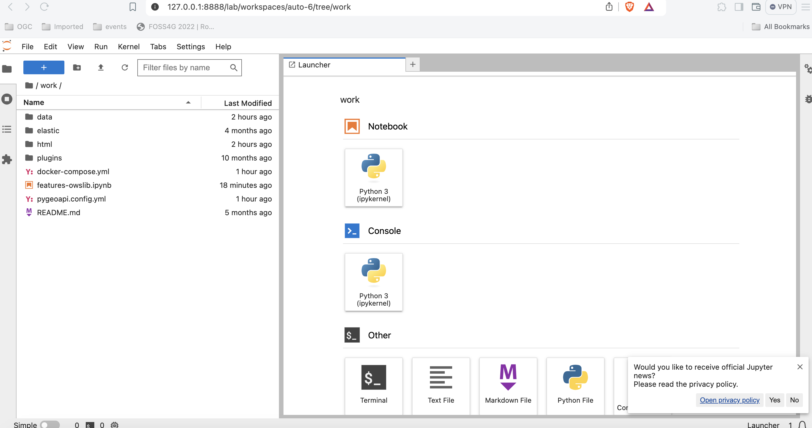

# Exercise 2 - Vector data via OGC API - Features

[OGC API - Features](https://ogcapi.ogc.org/features) provides a Web API to access vector 
data (geometries and their attributes). While the core specification covers basic data access and query,
additional related standards and extensions are in development for the following capabilities:

- [OGC API - Features - Part 1: Core](https://docs.ogc.org/is/17-069r4/17-069r4.html) provides basic access and query capabilities
- [OGC API - Features - Part 2: Coordinate Reference Systems by Reference](https://docs.ogc.org/is/18-058r1/18-058r1.html) enables the import and export of any data according to dedicated projections
- [OGC API - Features - Part 3: Filtering](https://docs.ogc.org/is/19-079r2/19-079r2.html) adds the ability for complex queries using [Common Query Language (CQL2)](https://docs.ogc.org/is/21-065r2/21-065r2.html)
- [OGC API - Features - Part 4: Create, Replace, Update and Delete](https://docs.ogc.org/DRAFTS/20-002r1.html) (**draft**) adds transactional capabilities 

## pygeoapi support

pygeoapi supports all of the above OGC API - Features specification parts (Part 3 is dependent on backend support i.e. Elasticsearch).

!!! note

    See [the official documentation](https://docs.pygeoapi.io/en/latest/data-publishing/ogcapi-features.html) for more information on supported vector backends

!!! note

    See [the official documentation](https://docs.pygeoapi.io/en/latest/cql.html) for more information on CQL support 

Next, we are going to explore how-to publish vector data using a `GeoPackage`.

## Publish a GeoPackage

In the previous section we demonstrated the steps involved to add a dataset to pygeoapi and update the configuration. 
In this exercise we are going to publish another vector file, this time from a [GeoPackage](https://www.geopackage.org) (SQLite3) 
vector data source.

!!! tip

    It may be helpful to open the dataset in [QGIS](https://qgis.org) while adding and updating your pygeoapi server to easily evaluate table attributes, names, spatial properties and CRS.


Let's add the file `workshop/exercises/data/tartu/cp-tartu2.gpkg.zip`:

!!! question "Update the pygeoapi configuration"

    First, let's unzip the file [cptartu2.gpkg.zip](https://github.com/geopython/diving-into-pygeoapi/tree/main/workshop/exercises/data/tartu/cptartu2.gpkg.zip) to `cptartu2.gpkg`.

    Then, open the pygeoapi configuration file in a text editor.
    Find the line `# START - EXERCISE 2 - cadastral parcels Tartu`.

    Add a new dataset section by uncommenting the lines up to `# END - EXERCISE 2 - cadastral parcels Tartu`:

    ``` {.yaml linenums="1"}
    cp-tartu:
        type: collection
        title: Tartu Cadastral Parcels
        description: Cadastral parcels in downtown Tartu
        keywords:
            - Cadastral parcels
            - Tartu
        links:
            -   type: OGC/WFS
                rel: canonical
                title: data
                href: https://metadata.geoportaal.ee/geonetwork/srv/metadata/9949ec81-f758-42e6-9c1c-6fb604a3f053
                hreflang: EE
        extents:
            spatial:
                bbox: [26.6, 58.3, 26.8, 58.5]
                crs: http://www.opengis.net/def/crs/OGC/1.3/CRS84
        providers:
            - type: feature
              name: SQLiteGPKG
              data: /data/tartu/cptartu2.gpkg # place correct path here
              id_field: nationalca
              title_field: label
              table: cptartu2 # table name within gpkg
    ```

Save the file and restart Docker Compose. Navigate to <http://localhost:5000/collections> to evaluate whether the new dataset with
title *"Tartu Cadastral Parcels"* has been published.

!!! note

    The SQLite driver incidentally has challenges to open the GeoPackage extension on MacOS. 
    Consult the [official documentation](https://docs.pygeoapi.io/en/latest/development.html#working-with-spatialite-on-osx) 
    or try with an alternative data format. If you use Docker this is not an issue.
 
## OPTIONAL: Publish a GeoJSON file using Elasticsearch

This exercise is optional, if time permits, or you can perform this after workshop.

Here we explore publishing OGC API - Features data using pygeoapi with an Elasticsearch backend provider. 
For this we need the [pygeoapi-examples GitHub repository](https://github.com/geopython/pygeoapi-examples):

=== "Linux/Mac"

    <div class="termy">
    ```bash
    git clone https://github.com/geopython/pygeoapi-examples.git
    ```
    </div>

=== "Windows (PowerShell)"

    <div class="termy">
    ```bash
    git clone https://github.com/geopython/pygeoapi-examples.git
    ```
    </div>

Alternatively, you can [download the repo as a .zip file](https://github.com/geopython/pygeoapi-examples/archive/refs/heads/main.zip) and unzip.

Change into the `docker/elastic` folder and run the `docker-compose.yml` file:

=== "Linux/Mac"

    <div class="termy">
    ```bash
    cd docker/elastic
    docker compose up
    ```
    </div>

=== "Windows (PowerShell)"

    <div class="termy">
    ```bash
    cd docker/elastic
    docker compose up
    ```
    </div>

If you experience startup problems, consult the [README file](https://github.com/geopython/pygeoapi-examples/blob/main/docker/elastic/README.md). 
You may need to adapt your local host system's virtual memory setting.

First we will load `greater_hyderabad_municipal_corporation_ward_Boundaries.geojson` into the Elasticsearch server. 

Edit the `add-data.sh` script within the `ES` folder, adding these two lines before the end:

``` {.bash linenums="1"}
curl -o /tmp/hyderabad.geojson https://raw.githubusercontent.com/geopython/diving-into-pygeoapi/refs/heads/main/workshop/exercises/data/hyderabad/greater_hyderabad_municipal_corporation_ward_Boundaries.geojson
python3 /load_es_data.py /tmp/hyderabad.geojson objectid
```
Through these changes the file `greater_hyderabad_municipal_corporation_ward_Boundaries.geojson` is downloaded inside the Elasticsearch Docker container and then loaded into Elasticsearch. 

After this we need to rebuild the Docker image:

=== "Linux/Mac"

    <div class="termy">
    ```bash
    docker compose build
    ```
    </div>

=== "Windows (PowerShell)"

    <div class="termy">
    ```bash
    docker compose build
    ```
    </div>

Next we need to configure pygeoapi by inserting the snippet below into the pygeoapi config file `pygeoapi/docker.config.yml`.
This effectively enables publishing the file `greater_hyderabad_municipal_corporation_ward_boundaries.geojson` as OGC API - Features
using the Elasticsearch backend provider.

``` {.yaml linenums="1"}
    hyderabad:
        type: collection
        title: Greater Hyderabad Municipal Corporation ward boundaries
        description: The city ward boundaries represent the administrative and electoral boundary areas of the city. It plays a great role in planning of the city, for each council of the municipal corporation.
        keywords:
           - Boundaries
           - Administrative
           - Ward
        links:
            - type: text/html
              rel: canonical
              title: information
              href: https://livingatlas-dcdev.opendata.arcgis.com/datasets/a090c89d52f1498f96a82e97b8bfb83e_0/about
              hreflang: en-US
        extents:
            spatial:
                bbox: [78.2379194985166180,17.2908061510471995,78.6217049083810764,17.5618443356918768]
                crs: http://www.opengis.net/def/crs/OGC/1.3/CRS84
            temporal:
                begin: 2011-11-11
                end: null  # or empty
        providers:
            - type: feature
              name: Elasticsearch
              #Note elastic_search is the docker container of ES the name is defined in the docker-compose.yml
              data: http://elastic_search:9200/hyderabad
              id_field: objectid
``` 

On startup (e.g.: docker compose up -d) the pygeaoapi container will wait until the data has been ingested and the Elasticsearch index has been built. 
You can check the logs using:

=== "Linux/Mac"

    <div class="termy">
    ```bash
    docker compose logs --follow
    ```
    </div>

=== "Windows (PowerShell)"

    <div class="termy">
    ```bash
    docker compose logs --follow
    ```
    </div>

After the server has started you can access the collection page here:

<http://localhost:5000/collections/hyderabad>

And the feature items here:

<http://localhost:5000/collections/hyderabad/items>

   { width=100% }

## OPTIONAL: pygeoapi as a WFS proxy

pygeoapi can also function as an OGC API - Features frontend service for an existing OGC WFS through 
the built-in GDAL/OGR provider. This bridging-function effectively allows you to publish a WFS as OGC API - Features.

This is expanded in an advanced section of this workshop: [pygeoapi as a Bridge to other Services WFS-section](../advanced/bridges.md#publishing-wfs-as-ogc-api-features). 

## Client access

### QGIS

QGIS is one of the first GIS Desktop clients which added support for OGC API - Features. Support has been integrated into the existing WFS provider.

!!! question "Open an OGC API - Features collection in QGIS"

    Follow the steps to add some collections from an OGC API - Features enpoint: 

    - Open QGIS (if you don't have QGIS, you can use OSGeoLive)
    - From the Layer menu, select `Add Layer` > `Add WFS layer`
    - From the `Data source manager` panel, choose 'New connection'
    
    { width=50% }
    
    - Add the URL https://demo.pygeoapi.io/master (or the address of a local server)
    - You can now click the `detect` button and QGIS will notice you are configuring an OGC API - Features endpoint
    - QGIS facilitates to set page size (request is split in multiple requests)
        - for points you can easily set it to 2500
        - for some polygons with high density, 100 can already be slow
    - Press `OK` to save the connection and return to the previous screen
    - Now click the `Connect` button to retireve the collections of the service
    
    { width=50% }
    
    - You can now add collections to your QGIS project
    - You can also build a query to add a subset of the collection
    - Close the `Data source manager`. Notice that QGIS applied a default styling just like it would if you add a file based layer. You can work with the collection in a similar way; identify, apply styling, filter, export, etc.


!!! tip

    Activate the `Debugging/Development Tools Panel` (right click anywhere on the toolbar icons and select). It will display HTTP traffic within QGIS and is a valuable tool in debugging failing connections.

!!! note

    An increasing number of GIS Desktop clients add support for OGC API's in subsequent releases. For example ArcGIS Pro [supports OGC API - Features](https://pro.arcgis.com/en/pro-app/2.8/help/data/services/use-ogc-api-services.htm) since release 2.8.

### GDAL/OGR - Advanced

[GDAL/OGR](https://gdal.org) provides support for [OGC API - Features](https://gdal.org/drivers/vector/oapif.html). This means you can use `ogrinfo`, `ogr2ogr` to query and convert data from OGC API - Features endpoints just like any other vector data source.  This also means you can make connections to OGC API - Features endpoints from any software which has an interface to GDAL, such as MapServer, GeoServer, Manifold, FME, ArcGIS, etc.

!!! question "Use OGR to interact with OGC API - Features"

    - Verify you have a recent GDAL installed, else use GDAL from OSGeoLive
    - Run `ogrinfo` on the command line to verify a connection to OGC API - Features

    === "Linux/Mac"

    <div class="termy">
        ```bash
        ogrinfo OAPIF:https://demo.pygeoapi.io/master/collections/obs
        ```
        </div>

    === "Windows (PowerShell)"

        <div class="termy">
        ```bash
        ogrinfo OAPIF:https://demo.pygeoapi.io/master/collections/obs
        ```
        </div>

    Check summary information about the layer with:

    === "Linux/Mac"

        <div class="termy">
        ```bash
        ogrinfo OAPIF:https://demo.pygeoapi.io/master/collections/obs obs -so
        ```
        </div>

    === "Windows (PowerShell)"

        <div class="termy">
        ```bash
        ogrinfo OAPIF:https://demo.pygeoapi.io/master/collections/obs obs -so
        ```
        </div>

    Now, let's convert the observations into a shapefile

    === "Linux/Mac"

        <div class="termy">
        ```bash
        ogr2ogr -f "ESRI Shapefile" obs.shp OAPIF:https://demo.pygeoapi.io/master/collections/obs
        ```
        </div>

    === "Windows (PowerShell)"

        <div class="termy">
        ```bash
        ogr2ogr -f "ESRI Shapefile" obs.shp OAPIF:https://demo.pygeoapi.io/master/collections/obs
        ```
        </div>

!!! Note

    You can even use OGR to append new features to an OGC API - Features collection which supports transactions. Read more [here](https://docs.pygeoapi.io/en/latest/transactions.html) about support for transactions in pygeoapi.


!!! tip "Use GDAL from the commandline with Docker"

    If you do not have GDAL installed, or want to use/try another version, you can always run the GDAL Docker image
    directly from the commandline. OSGeo provides [GDAL Docker Images](https://github.com/OSGeo/gdal/pkgs/container/gdal). The main thing to deal with is proper Docker Volume mapping to have GDAL tools 
    access local files. This can be very handy for quick data conversions. Most images also come with GDAL Python bindings.
    
    First you can pull a very small Docker Image:

    === "Linux/Mac"

        <div class="termy">
        ```bash
        docker pull ghcr.io/osgeo/gdal:alpine-small-latest
        ```
        </div>

    === "Windows (PowerShell)"

        <div class="termy">
        ```bash
        docker pull ghcr.io/osgeo/gdal:alpine-small-latest
        ```
        </div>

    Then you can run for example OGR command line tools. Base command is `docker run -it --rm ghcr.io/osgeo/gdal:alpine-small-latest`.
    This runs the Docker container interactively (`-it`) and removes the container on exit (`--rm`).  Below are examples.

    Ask GDAL/OGR for available Vector formats:

    === "Linux/Mac"

        <div class="termy">
        ```bash
        docker run -it --rm ghcr.io/osgeo/gdal:alpine-small-latest \
                            ogrinfo --formats
        ```
        </div>

    === "Windows (PowerShell)"

        <div class="termy">
        ```bash
        docker run -it --rm ghcr.io/osgeo/gdal:alpine-small-latest ogrinfo --formats
        ```
        </div>

    Get information from a geospatial file. Note the volume mapping: `-v $(pwd)/data:/work` 
    to access local files within the Docker container (commands are single-line, broken up for readability).

    === "Linux/Mac"

        <div class="termy">
        ```bash
        cd git/workshop/exercises
        docker run -v $(pwd)/data:/work -it --rm \
           ghcr.io/osgeo/gdal:alpine-small-latest \
           ogrinfo /work/tartu/bathingwater-estonia.geojson

        INFO: Open of `/work/tartu/bathingwater-estonia.geojson'
              using driver `GeoJSON' successful.
        1: bathingwater-estonia (Point)
        ```
        </div>

    === "Windows (PowerShell)"

        <div class="termy">
        ```bash
        cd git/workshop/exercises
        docker run -v ${pwd}/data:/work -it --rm ghcr.io/osgeo/gdal:alpine-small-latest ogrinfo /work/tartu/bathingwater-estonia.geojson

        INFO: Open of `/work/tartu/bathingwater-estonia.geojson'
              using driver `GeoJSON' successful.
        1: bathingwater-estonia (Point)
        ```
        </div>

    Convert the GeoJSON file to a GeoPackage (GPKG) with `ogr2ogr`:

    === "Linux/Mac"

        <div class="termy">
        ```bash
        docker run -v $(pwd)/data:/work -it --rm \
           ghcr.io/osgeo/gdal:alpine-small-latest \
           ogr2ogr -f "GPKG" /work/tartu/bathingwater-estonia.gpkg \
                             /work/tartu/bathingwater-estonia.geojson
        ```
        </div>

    === "Windows (PowerShell)"

        <div class="termy">
        ```bash
        docker run -v ${pwd}/data:/work -it --rm ghcr.io/osgeo/gdal:alpine-small-latest ogr2ogr -f "GPKG" /work/tartu/bathingwater-estonia.gpkg /work/tartu/bathingwater-estonia.geojson
         ```
        </div>

    You can also use `ogrinfo` retrieve information about an OGC API - Features collection.  In case you are accessing a local collection, you will need to make sure the container runs on the host network:

    === "Linux/Mac"

        <div class="termy">
        ```bash
        docker run \
        --network=host \
        ghcr.io/osgeo/gdal:alpine-small-latest \
        ogrinfo OAPIF:http://localhost:5000/collections/obs obs -so
        ```
        </div>

    === "Windows"

        <div class="termy">
        ```bash
        docker run --network=host ghcr.io/osgeo/gdal:alpine-small-latest ogrinfo OAPIF:http://localhost:5000/collections/obs obs -so
        ```
        </div>

### OWSLib - Advanced

[OWSLib](https://owslib.readthedocs.io) is a Python library to interact with OGC Web Services and supports a number of OGC APIs including OGC API - Features.

This exercise will be done using a jupyter notebook. If you prefer, you can do it using python from the command line (see bellow).

Before continuing, make sure you are in the `workshop/exercises` folder. You will need that, to be able to use the jupyter notebook.

=== "Linux/Mac"

    <div class="termy">
    ```bash
    pwd
    ```
    </div>
    
=== "Windows (PowerShell)"

    <div class="termy">
    ```bash
    cd
    ```
    </div>

Then run a container to start a jupyter notebook, mounting the local folder:

=== "Linux/Mac"

    <div class="termy">
    ```bash
    docker run -p 8888:8888 -v $(pwd):/home/jovyan/work jupyter/base-notebook
    ```
    </div>
    
=== "Windows (PowerShell)"

    <div class="termy">
    ```bash
    docker run -p 8888:8888 -v ${pwd}:/home/jovyan/work jupyter/base-notebook
    ```
    </div>

Enter the url stated on the command line,  `http://127.0.0.1:8888/lab` followed by a token. Enter the `work` folder and open the `features-owslib.ipynb`.



Run through the notebook, to explore an OGC API - Features server, using owslib.

!!! note

    You can run the same instructions using your local pygeoapi server, instead of the demo pygeoapi instance.

#### Using python from the command line

!!! question "Interact with OGC API - Features via OWSLib"

    If you do not have Python installed, consider running this exercise in a Docker container. See the [Setup Chapter](../setup.md#using-docker-for-python-clients).

    === "Linux/Mac"

        <div class="termy">
        ```bash
        pip3 install owslib
        ```
        </div>

    === "Windows (PowerShell)"

        <div class="termy">
        ```bash
        pip3 install owslib
        ```
        </div>

    Then start a Python console session with `python3` (stop the session by typing `exit()`).

    === "Linux/Mac"

        <div class="termy">
        ```python
        >>> from owslib.ogcapi.features import Features
        >>> w = Features('https://demo.pygeoapi.io/master')
        >>> w.url
        'https://demo.pygeoapi.io/master'
        >>> conformance = w.conformance()
        {u'conformsTo': [u'http://www.opengis.net/spec/ogcapi-features-1/1.0/conf/core', u'http://www.opengis.net/spec/ogcapi-features-1/1.0/conf/oas30', u'http://www.opengis.net/spec/ogcapi-features-1/1.0/conf/html', u'http://www.opengis.net/spec/ogcapi-features-1/1.0/conf/geojson']}
        >>> api = w.api()  # OpenAPI document
        >>> collections = w.collections()
        >>> len(collections['collections'])
        13
        >>> feature_collections = w.feature_collections()
        >>> len(feature_collections)
        13
        >>> lakes = w.collection('lakes')
        >>> lakes['id']
        'lakes'
        >>> lakes['title']
        'Large Lakes'
        >>> lakes['description']
        'lakes of the world, public domain'
        >>> lakes_queryables = w.collection_queryables('lakes')
        >>> len(lakes_queryables['properties'])
        6
        >>> lakes_query = w.collection_items('lakes')
        >>> lakes_query['features'][0]['properties']
        {u'scalerank': 0, u'name_alt': None, u'admin': None, u'featureclass': u'Lake', u'id': 0, u'name': u'Lake Baikal'}
        ```
        </div>

    === "Windows (PowerShell)"

        <div class="termy">
        ```python
        >>> from owslib.ogcapi.features import Features
        >>> w = Features('https://demo.pygeoapi.io/master')
        >>> w.url
        'https://demo.pygeoapi.io/master'
        >>> conformance = w.conformance()
        {u'conformsTo': [u'http://www.opengis.net/spec/ogcapi-features-1/1.0/conf/core', u'http://www.opengis.net/spec/ogcapi-features-1/1.0/conf/oas30', u'http://www.opengis.net/spec/ogcapi-features-1/1.0/conf/html', u'http://www.opengis.net/spec/ogcapi-features-1/1.0/conf/geojson']}
        >>> api = w.api()  # OpenAPI document
        >>> collections = w.collections()
        >>> len(collections['collections'])
        13
        >>> feature_collections = w.feature_collections()
        >>> len(feature_collections)
        13
        >>> lakes = w.collection('lakes')
        >>> lakes['id']
        'lakes'
        >>> lakes['title']
        'Large Lakes'
        >>> lakes['description']
        'lakes of the world, public domain'
        >>> lakes_queryables = w.collection_queryables('lakes')
        >>> len(lakes_queryables['properties'])
        6
        >>> lakes_query = w.collection_items('lakes')
        >>> lakes_query['features'][0]['properties']
        {u'scalerank': 0, u'name_alt': None, u'admin': None, u'featureclass': u'Lake', u'id': 0, u'name': u'Lake Baikal'}
        ```
        </div>

!!! note

    See the official [OWSLib documentation](https://owslib.readthedocs.io/en/latest/usage.html#ogc-api) for more examples.

# Summary

Congratulations! You are now able to publish vector data with pygeoapi.
