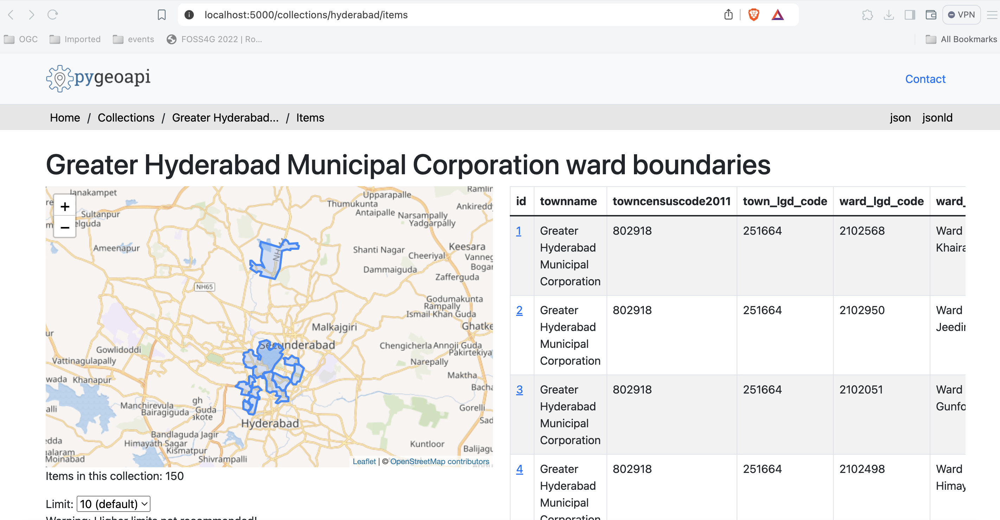

# Exercise 2 - Vector data via OGC API - Features

[OGC API - Features](https://ogcapi.ogc.org/features) provides a Web API to access vector 
data (geometries and their attributes). While the core specification covers basic data access and query,
additional related standards and extensions are in development for the following capabilities:

- [OGC API - Features - Part 1: Core](https://docs.opengeospatial.org/is/17-069r4/17-069r4.html) provides basic access and query capabilities
- [OGC API - Features - Part 2: Coordinate Reference Systems by Reference](https://docs.opengeospatial.org/is/18-058r1/18-058r1.html) enables the import and export of any data according to dedicated projections
- [OGC API - Features - Part 3: Filtering](https://docs.ogc.org/DRAFTS/19-079r1.html) (**draft**) adds the ability for complex queries using Common Query Language (CQL)
- [OGC API - Features - Part 4: Create, Replace, Update and Delete](https://docs.ogc.org/DRAFTS/20-002.html) (**draft**) adds transactional capabilities

## pygeoapi support

pygeoapi supports all of the above OGC API - Features specification parts (Part 3 is dependent on backend support i.e. Elasticsearch).

!!! note

    See [the official documentation](https://docs.pygeoapi.io/en/latest/data-publishing/ogcapi-features.html) for more information on supported vector backends

!!! note

    See [the official documentation](https://docs.pygeoapi.io/en/latest/cql.html) for more information on CQL support 

Next, we are going to explore how-to publish vector data using a `GeoPackage` and a `Elasticsearch` backend.

## Publish a GeoPackage

In the previous section we demonstrated the steps involved to add a dataset to pygeoapi and update the configuration. 
In this exercise we are going to publish another vector file, this time from a [GeoPackage](https://www.geopackage.org) (SQLite3) 
data source.

!!! tip

    It may be helpful to open the dataset in [QGIS](https://qgis.org) while adding and updating your pygeoapi server to easily evaluate table attributes, names, spatial properties and CRS.


Let's add the file `workshop/exercises/data/osm_places_kosovo.gpkg`:

!!! question "Update the pygeoapi configuration"

    Open the pygeoapi configuration file in a text editor.
    Find the line: 
    "# START - EXERCISE 2 - osm_places" 

    Add a new dataset section by uncommenting the lines up to
    "# END - EXERCISE 2 - osm_places":

    ``` {.yaml linenums="1"}
    osm_places-vec:
        type: collection
        title: Places in Kosovo 2023
        description: Places in Kosovo as maintained by the Open Street Map Community
        keywords:
            - places
            - Kosovo
        links:
            -   type: text/csv
                rel: canonical
                title: data
                href: https://download.geofabrik.de/europe/kosovo.html
                hreflang: AL
    extents:
        spatial:
            bbox: [20,41.9,21.7,43.2]
            crs: http://www.opengis.net/def/crs/OGC/1.3/CRS84
        providers:
            - type: feature
              name: SQLiteGPKG
              data: /data/osm_places_kosovo.gpkg # place correct path here
              id_field: osm_id
              title_field: name
              table: gis_osm_places_free_1 # table name within gpkg
    ```

Save the file and restart Docker Compose. Navigate to <http://localhost:5000/collections> to evaluate whether the new dataset with
title *"Places in Kosovo 2023"* has been published.

!!! note

    The SQLite driver incidentally has challenges to open the GeoPackage extension on MacOS. 
    Consult the [official documentation](https://docs.pygeoapi.io/en/latest/development.html#working-with-spatialite-on-osx) 
    or try with an alternative data format.
 
## Publish a GeoJSON using Elasticsearch

If you want to explore publishing vector tiles using Elasticsearch clone this fork of pygeoapi:

<div class="termy">
```bash
git checkout -b ogcapi-ws https://github.com/doublebyte1/pygeoapi.git
```
</div>

In alternative, you can download a zip file from [this](https://github.com/doublebyte1/pygeoapi/archive/refs/heads/ogcapi-ws.zip) link.

Then change into the `docker/examples/elastic` folder, and run the `docker-compose` file:

<div class="termy">
```bash
cd docker/examples/elastic

docker-compose up
```
</div>

This configuration snippet, enables publishing greater_hyderabad_municipal_corporation_ward_boundaries.geojson as OGC API - Features:

``` {.yaml linenums="1"}
    greater_hyderabad_municipal_corporation_ward_boundaries:
        type: collection
        title: Greater Hyderabad Municipal Corporation ward boundaries
        description: The city ward boundaries represent the administrative and electoral boundary areas of the city. It plays a great role in planning of the city, for each council of the municipal corporation.
        keywords:
           - Boundaries
           - Administrative
           - Ward
        links:
            - type: text/html
              rel: canonical
              title: information
              href: https://livingatlas-dcdev.opendata.arcgis.com/datasets/a090c89d52f1498f96a82e97b8bfb83e_0/about
              hreflang: en-US
        extents:
            spatial:
                bbox: [78.2379194985166180,17.2908061510471995,78.6217049083810764,17.5618443356918768]
                crs: http://www.opengis.net/def/crs/OGC/1.3/CRS84
            temporal:
                begin: 2011-11-11
                end: null  # or empty
        providers:
            - type: feature
              name: Elasticsearch
              #Note elastic_search is the docker container of ES the name is defined in the docker-compose.yml
              data: http://elastic_search:9200/greater_hyderabad_municipal_corporation_ward_boundaries
              id_field: objectid
``` 

Wait until the data was ingested into an elastic index, and pygeoapi starts. You can check the logs using:

<div class="termy">
```bash
docker-compose logs --follow
```
</div>

After the server has started you can access the collection page here:

<http://localhost:5000/collections/greater_hyderabad_municipal_corporation_ward_boundaries>

And the feature items here:

<http://localhost:5000/collections/greater_hyderabad_municipal_corporation_ward_boundaries/items>

   { width=100% }

## pygeoapi as a WFS proxy

You can check the "pygeoapi as a Bridge to Other Services" section to learn how to [publish WFS as OGC API - Features](../../advanced/bridges/#publishing-wfs-as-ogc-api-features).

## Client access

### QGIS

QGIS is one of the first GIS Desktop clients which added support for OGC API - Features. Support has been integrated into the existing WFS provider.

!!! question "Open an OGC API - Features collection in QGIS"

    Follow the steps to add some collections from an OGC API - Features enpoint: 

    - Open QGIS (if you don't have QGIS, you can use OSGeoLive)
    - From the Layer menu, select `Add Layer` > `Add WFS layer`
    - From the `Data source manager` panel, choose 'New connection'
    
    { width=50% }
    
    - Add the URL https://demo.pygeoapi.io/master (or the address of a local server)
    - You can now click the `detect` button and QGIS will notice you are configuring an OGC API - Features endpoint
    - QGIS facilitates to set page size (request is split in multiple requests)
        - for points you can easily set it to 2500
        - for some polygons with high density, 100 can already be slow
    - Press `OK` to save the connection and return to the previous screen
    - Now click the `Connect` button to retireve the collections of the service
    
    { width=50% }
    
    - You can now add collections to your QGIS project
    - You can also build a query to add a subset of the collection
    - Close the `Data source manager`. Notice that QGIS applied a default styling just like it would if you add a file based layer. You can work with the collection in a similar way; identify, apply styling, filter, export, etc.


!!! tip

    Install and activate the `QGIS Network Logger` extension. It will display HTTP traffic within QGIS and is a valuable tool in debugging failing connections.

!!! note

    An increasing number of GIS Desktop clients add support for OGC API's in subsequent releases. For example ArcGIS Pro [supports OGC API - Features](https://pro.arcgis.com/en/pro-app/2.8/help/data/services/use-ogc-api-services.htm) since release 2.8.

### GDAL/OGR - Advanced

[GDAL/OGR](https://gdal.org) provides support for [OGC API - Features](https://gdal.org/drivers/vector/oapif.html). This means you can use `ogrinfo`, `ogr2ogr` to query and convert data from OGC API - Features endpoints just like any other vector data source.  This also means you can make connections to OGC API - Features endpoints from any software which has an interface to GDAL, such as MapServer, GeoServer, Manifold, FME, ArcGIS, etc.

!!! question "Use OGR to interact with OGC API - Features"

    - Verify you have a recent GDAL installed, else use GDAL from OSGeoLive
    - Run `ogrinfo` on the command line to verify a connection to OGC API - Features

    <div class="termy">
    ```bash
    ogrinfo OAPIF:https://demo.pygeoapi.io/master/collections/obs
    ```
    </div>
    
    Now, let's convert the observations into a shapefile

    <div class="termy">
    ```bash
    ogr2ogr -f "ESRI Shapefile" obs.shp OAPIF:https://demo.pygeoapi.io/master/collections/obs
    ```
    </div>

!!! Note

    You can even use OGR to append new features to an OGC API - Features collection which supports transactions (pygeoapi transaction support is planned for future implementation)

### OWSLib - Advanced

[OWSLib](https://owslib.readthedocs.io) is a Python library to interact with OGC Web Services and supports a number of OGC APIs including OGC API - Features.

!!! question "Interact with OGC API - Features via OWSLib"

    If you do not have Python installed, consider running this exercise in a Docker container. See the [Setup Chapter](../setup.md#using-docker-for-python-clients).

    <div class="termy">
    ```bash
    pip3 install owslib
    ```
    </div>

    Then start a Python console session with: `python` (stop the session by typing `exit()`).

    <div class="termy">
    ```python
    >>> from owslib.ogcapi.features import Features
    >>> w = Features('https://demo.pygeoapi.io/master')
    >>> w.url
    'https://demo.pygeoapi.io/master'
    >>> conformance = w.conformance()
    {u'conformsTo': [u'http://www.opengis.net/spec/ogcapi-features-1/1.0/conf/core', u'http://www.opengis.net/spec/ogcapi-features-1/1.0/conf/oas30', u'http://www.opengis.net/spec/ogcapi-features-1/1.0/conf/html', u'http://www.opengis.net/spec/ogcapi-features-1/1.0/conf/geojson']}
    >>> api = w.api()  # OpenAPI document/
    >>> collections = w.collections()
    >>> len(collections['collections'])
    13
    >>> feature_collections = w.feature_collections()
    >>> len(feature_collections)
    13
    >>> lakes = w.collection('lakes')
    >>> lakes['id']
    'lakes'
    >>> lakes['title']
    'Large Lakes'
    >>> lakes['description']
    'lakes of the world, public domain'
    >>> lakes_queryables = w.collection_queryables('lakes')
    >>> len(lakes_queryables['properties'])
    6
    >>> lakes_query = w.collection_items('lakes')
    >>> lakes_query['features'][0]['properties']
    {u'scalerank': 0, u'name_alt': None, u'admin': None, u'featureclass': u'Lake', u'id': 0, u'name': u'Lake Baikal'}
    ```
    </div>

!!! note

    See the official [OWSLib documentation](https://owslib.readthedocs.io/en/latest/usage.html#ogc-api) for more examples.

# Summary

Congratulations! You are now able to publish vector data to pygeoapi.
