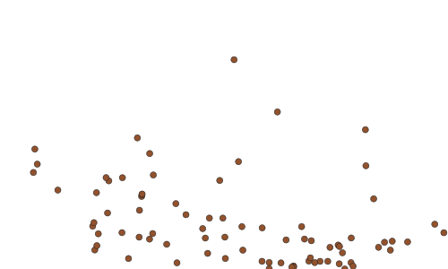
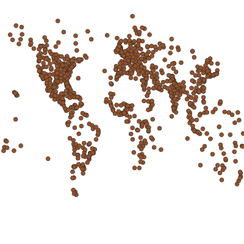
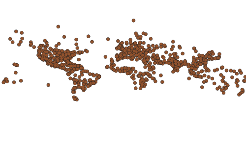
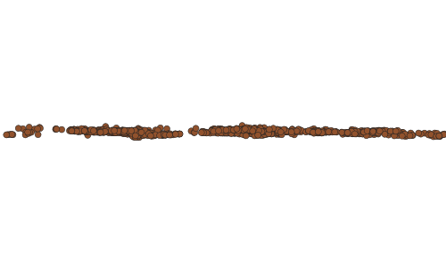
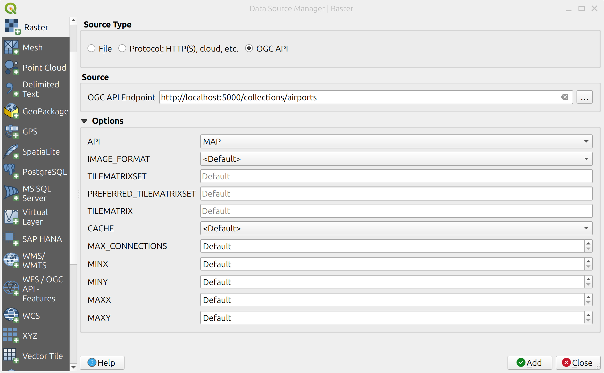
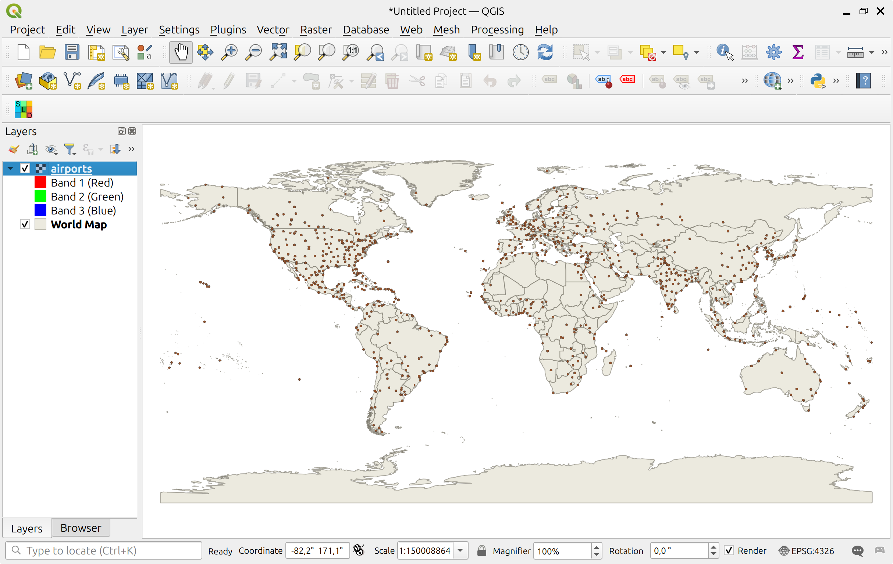

# Exercise 4 - Maps of geospatial data via OGC API - Maps

[OGC API - Maps](https://ogcapi.ogc.org/maps) provides a Web API to access
any geospatial data as a georeferenced map image.

* [OGC API - Maps](https://docs.ogc.org/is/20-058/20-058.html)

Here are a few things that a client can request from a OGC API - Maps server:

* Request a visual representation of one or more geospatial data layers in different styles;
* Select by area, time and resolution of interest;
* Change parameters such as the width, height and coordinate reference systems.

OGC API - Maps is great for *creating custom maps, that could be used for printing or displaying as static images*. OGC API - Maps is **not** great for *providing interactive maps on the web*; there are Standards that are more suitable for that purpose, from the efficiency point of view (see [OGC API - Tiles](./ogcapi-tiles.md))

## pygeoapi support

pygeoapi supports the OGC API - Maps specification, using [MapServer MapScript](https://www.mapserver.org/mapscript) and a WMS facade as core backends.

!!! note

    See [the official documentation](https://docs.pygeoapi.io/en/latest/publishing/ogcapi-maps.html) for more information on supported map backends

## Publish a vector dataset

In this section we'll be exposing a Geopackage file available at `workshop/exercises/data/airport.gpkg` location using [MapServer MapScript](https://www.mapserver.org/mapscript). This data can be consumed with various clients which are compliant with OGC APIs - Maps. List of few such clients can be found [here](https://github.com/opengeospatial/ogcapi-maps/blob/master/implementations.adoc#clients). Here we can also pass style in *.sld* format. Which can be generated on [Geoserver](https://docs.geoserver.org/stable/en/user/styling/index.html), [QGIS](https://www.qgistutorials.com/en/docs/3/basic_vector_styling.html), etc. 
 
!!! question "Interact with OGC API - Maps via MapScript"

    Open the pygeoapi configuration file in a text editor. Find the line `# START - EXERCISE 4 - Maps`.

    Uncomment section related to #airports.

    ```{.yaml linenums="1"}
    airports:
        type: collection
        title: airports of the world
        description: Point data representing airports around the world with various metadata such as name, Code, etc.
        keywords:
            - airports
            - natural earth
        links:
            - type: text/html
              rel: canonical
              title: information
              href: https://www.naturalearthdata.com/downloads/10m-cultural-vectors/airports/
              hreflang: en-US
        extents:
            spatial:
                bbox: [-180,-90,180,90]
                crs: http://www.opengis.net/def/crs/OGC/1.3/CRS84
            temporal:
                begin:
                end: null  # or empty
        providers:
            - type: map
              name: MapScript
              data: /data/airport.gpkg
              options:
                  type: MS_LAYER_POINT
                  layer: airport
                  style: /data/airport.sld
              format:
                  name: png
                  mimetype: image/png
            - type: feature
              name: SQLiteGPKG
              data: /data/airport.gpkg
              id_field: fid
              table: airport
    ```

After the server has started you can access the collection page here:

http://localhost:5000/collections/airports

And the map here:

http://localhost:5000/collections/airports/map?f=png

{ width=50% }

!!! note

    The airport data is published as **both** a map and a feature collection through a single endpoint (`/collections/airports`).  How is this made possible in the above configuration?

The map comes with the default CRS84 CRS, but you can easily change it with the `crs` parameter:

http://localhost:5000/collections/airports/map?f=png&crs=EPSG:3857

You can also use tweak other parameters, like bounding box (`bbox`), bounding box crs (`bbox-crs`) and `with` & `height`, to create custom maps:

http://localhost:5000/collections/airports/map?f=png&bbox-crs=OGC:CRS84&bbox=-142,42,-52,84

{ width=50% }

http://localhost:5000/collections/airports/map?f=png&width=400&height=400

{ width=50% }


!!! note

    Check-out the [OGC API - Maps Standard](https://docs.ogc.org/is/20-058/20-058.html), for more details about the map parameters. 

!!! note

    OGC API - Maps supports CRS from CURIEs (e.g.: `EPSG:4326`, `CRS84`), safe CURIEs (e.g.: `[EPSG:4326]`, `[CRS84]`) and URIs:
    
    <http://localhost:5000/collections/airports/map?f=png&crs=https://www.opengis.net/def/crs/EPSG/0/3857>

    <http://localhost:5000/collections/airports/map?f=png&crs=https://www.opengis.net/def/crs/EPSG/0/3395>

    |  |  |  |
    |:---:|:---:|:---:|
    | EPSG:4326 | EPSG:3857 | EPSG:3395 |

    You can read more about the different ways of expressing CRSs on the maps section of the [pygeoapi documentation](https://docs.pygeoapi.io/en/latest/publishing/ogcapi-maps.html).

## OPTIONAL: pygeoapi as a WMS proxy

You can check the "pygeoapi as a Bridge to Other Services" section to learn how to [publish WMS as OGC API - Maps](../advanced/bridges.md#publishing-wms-as-ogc-api-maps).

## Client access

### QGIS

QGIS added support for API's providing rendered image layers via its raster support. 

!!! question "Add OGC API - Maps layer to QGIS"

    - Install a recent version of QGIS (>3.28). 
    - Open the `Add raster layer panel`.
    - Select `OGCAPI` for Source type.
    - Add the local endpoint as source `http://localhost:5000/collections/airports`.
    - Select `MAP` as API.
    - Finally add the layer to the map.


    { width=50% }

    { width=50% }

### OWSLib

[OWSLib](https://owslib.readthedocs.io) is a Python library to interact with OGC Web Services and supports a number of OGC APIs including OGC API - Maps.

!!! question "Interact with OGC API - Maps via OWSLib"

    If you do not have Python installed, consider running this exercise in a Docker container. See the [Setup Chapter](../setup.md#using-docker-for-python-clients).

    === "Linux/Mac"

        ```bash
        pip3 install owslib
        ```

    === "Windows (PowerShell)"

        ```bash
        pip3 install owslib
        ```

    Now running in Python:

    === "Linux/Mac"

        ```python
        >>> from owslib.ogcapi.maps import Maps
        >>> m = Maps('http://localhost:5000')
        >>> data = m.map('airports', width=1200, height=800, transparent=False)
        >>> with open("output.png", "wb") as fh:
        ...     fh.write(data.getbuffer())
        ```

    === "Windows (PowerShell)"

        ```python
        >>> from owslib.ogcapi.maps import Maps
        >>> m = Maps('http://localhost:5000')
        >>> data = m.map('airports', width=1200, height=800, transparent=False)
        >>> with open("output.png", "wb") as fh:
        ...     fh.write(data.getbuffer())
        ```

!!! note

    See the official [OWSLib documentation](https://owslib.readthedocs.io/en/latest/usage.html#ogc-api) for more examples.

# Summary

Congratulations! You are now able to serve an OGC WMS via pygeoapi and OGC API - Maps.
