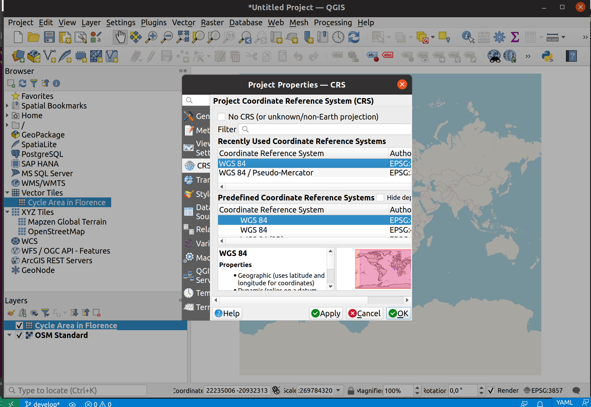

# Exercise 4 - Tiles of geospatial data via OGC API - Tiles

[OGC API - Tiles](https://ogcapi.ogc.org/tiles) provides a Web API to deliver tiles of geospatial information. Different forms of geospatial information are supported, such as tiles of vector features ("vector tiles"), coverages, maps (or imagery) and potentially eventually additional types of tiles of geospatial information. The standard is available on this document:
 
* [OGC API - Tiles: Part 1: Core](https://docs.ogc.org/is/20-057/20-057.html)

!!! note
    OGC API - Tiles extends the `collections/*` URL structure (tilesets are listed under `/collections/example/tiles`:

    ```
    https://demo.pygeoapi.io/collections/lakes/tiles/WorldCRS84Quad/{tileMatrix}/{tileRow}/{tileCol}?f=mvt
    ```

## pygeoapi support

pygeoapi supports the core OGC API - Tiles specification, and is able to advertise an existing tileset. Note that pygeoapi
itself does not render tiles from source data. It supports publishing pre-rendered tiles from a static url or from a tile server with a `xyz` url template.

!!! note

    The OGC API - Tiles URL structure is compatible with XYZ layers in common libraries such as OpenLayers, Leaflet and MapML

!!! note

    See [the official documentation](https://docs.pygeoapi.io/en/latest/data-publishing/ogcapi-tiles.html) for more information on supported tile backends

## Publish pre-rendered vector tiles

In this scenario, tiles must be pre-rendered before serving. Existing tools to create tiles
include, but are not limited to:

* [TileMill](https://tilemill-project.github.io/tilemill)
* [MapProxy](https://mapproxy.org)
* [QGIS](https://www.qgistutorials.com/en/docs/creating_basemaps_with_qtiles.html)
* [tippecanoe](https://github.com/mapbox/tippecanoe)

For this exercise, you will publish a vector dataset of the [greater Hyderabad municipal corporation ward boundaries](https://livingatlas-dcdev.opendata.arcgis.com/datasets/a090c89d52f1498f96a82e97b8bfb83e_0/about), from the location below:

* data: `workshop/exercises/data/greater_hyderabad_municipal_corporation_ward_Boundaries.geojson`

Let's generate the tiles as the first step using tippecanoe:

!!! example "Using tippecanoe to generate vector tiles"

    === "Linux/Mac"
    
        <div class="termy">
        ```bash
        cd workshop/exercises
        docker run -it --rm -v $(pwd)/data:/data emotionalcities/tippecanoe \
        tippecanoe --output-to-directory=/data/tiles/ --force --maximum-zoom=16 --drop-densest-as-needed --extend-zooms-if-still-dropping --no-tile-compression /data/greater_hyderabad_municipal_corporation_ward_Boundaries.geojson
        ```
        </div>
     
    === "Windows"
    
        <div class="termy">
        ```bash
        cd workshop/exercises
        docker run -it --rm -v ${pwd}/data:/data emotionalcities/tippecanoe tippecanoe --output-to-directory=/data/tiles/ --force --maximum-zoom=16 --drop-densest-as-needed --extend-zooms-if-still-dropping --no-tile-compression /data/greater_hyderabad_municipal_corporation_ward_Boundaries.geojson
        ```
        </div>
 
!!! question "Update the pygeoapi configuration"

    Open the pygeoapi configuration in a text editor. Add a new dataset section as follows:

``` {.yaml linenums="1"}
    hyderabad:
        type: collection
        title: Greater Hyderabad Municipal Corporation ward boundaries
        description: The city ward boundaries represent the administrative and electoral boundary areas of the city. It plays a great role in planning of the city, for each council of the municipal corporation.
        keywords:
           - Boundaries
           - Administrative
           - Ward
        links:
            - type: text/html
              rel: canonical
              title: information
              href: https://livingatlas-dcdev.opendata.arcgis.com/datasets/a090c89d52f1498f96a82e97b8bfb83e_0/about
              hreflang: en-US
        extents:
            spatial:
                bbox: [78.2379194985166180,17.2908061510471995,78.6217049083810764,17.5618443356918768]
                crs: http://www.opengis.net/def/crs/OGC/1.3/CRS84
            temporal:
                begin: 2011-11-11
                end: null  # or empty
        providers:
            - type: feature
              name: GeoJSON
              data: /data/greater_hyderabad_municipal_corporation_ward_Boundaries.geojson
              id_field: objectid
            - type: tile
              name: MVT
              data: /data/tiles
              options:
                metadata_format: tilejson # default | tilejson
                zoom:
                    min: 0
                    max: 16
                schemes:
                    - WorldCRS84Quad
              format:
                    name: pbf
                    mimetype: application/vnd.mapbox-vector-tile
```

Save the file and restart Docker Compose. Navigate to <http://localhost:5000/collections> to evaluate whether the new dataset has been published.

Additional check for the following tile specific endpoints in the `Hyderabad` collection:

- tile links in <http://localhost:5000/collections/hyderabad/tiles>
- tile metadata in <http://localhost:5000/collections/hyderabad/tiles/WorldCRS84Quad/metadata>


## Publish vector tiles from Elasticsearch

Elasticsearch provides a middleware that [renders an index on the fly, as vector tiles](https://www.elastic.co/blog/introducing-elasticsearch-vector-tile-search-api-for-geospatial). This middleware is also supported by the pygeoapi mvt backend.

If you want to explore publishing vector tiles using Elasticsearch clone this fork of pygeoapi:

<div class="termy">
```bash
git checkout -b ogcapi-ws https://github.com/doublebyte1/pygeoapi.git
```
</div>

Then change into the `docker/examples/elastic` folder, and run the `docker-compose.yml` file:

<div class="termy">
```bash
cd docker/examples/elastic

docker compose up
```
</div>

This configuration, enables publishing greater_hyderabad_municipal_corporation_ward_boundaries.geojson as both OGC API - Features and OGC API - Tiles:

``` {.yaml linenums="1"}
    greater_hyderabad_municipal_corporation_ward_boundaries:
        type: collection
        title: Greater Hyderabad Municipal Corporation ward boundaries
        description: The city ward boundaries represent the administrative and electoral boundary areas of the city. It plays a great role in planning of the city, for each council of the municipal corporation.
        keywords:
           - Boundaries
           - Administrative
           - Ward
        links:
            - type: text/html
              rel: canonical
              title: information
              href: https://livingatlas-dcdev.opendata.arcgis.com/datasets/a090c89d52f1498f96a82e97b8bfb83e_0/about
              hreflang: en-US
        extents:
            spatial:
                bbox: [78.2379194985166180,17.2908061510471995,78.6217049083810764,17.5618443356918768]
                crs: http://www.opengis.net/def/crs/OGC/1.3/CRS84
            temporal:
                begin: 2011-11-11
                end: null  # or empty
        providers:
            - type: feature
              name: Elasticsearch
              # note: elastic_search is the Docker container name as defined in docker-compose.yml
              data: http://elastic_search:9200/greater_hyderabad_municipal_corporation_ward_boundaries
              id_field: objectid
            - type: tile
              name: MVT
              data: http://elastic_search:9200/greater_hyderabad_municipal_corporation_ward_boundaries/_mvt/geometry/{z}/{x}/{y}?grid_precision=0
              # index must have a geo_point
              options:
                metadata_format: none # default | tilejson
                zoom:
                    min: 0
                    max: 16
                schemes:
                    - WorldCRS84Quad
              format:
                    name: pbf
                    mimetype: application/vnd.mapbox-vector-tile
```

## Client access

### QGIS

QGIS supports OGC API Vector Tiles via the [Vector Tiles Layer](https://docs.qgis.org/3.22/en/docs/user_manual/working_with_vector_tiles/vector_tiles_properties.html). Although OGC API - Tiles are not natively supported, you can customize the `generic connection` in order to access them in QGIS.

!!! question "Access OGC API Vector Tiles from QGIS"

    Before entering QGIS, access your pygeoapi installation page on the browser and follow these steps.

    - access the collection page of the tiles dataset: <http://localhost:5000/collections/hyderabad>
    - navigate to the tiles page by clicking on `tiles`: <http://localhost:5000/collections/hyderabad/tiles>
    - click in `Tiles metadata in tilejson format`: <http://localhost:5000/collections/Cycle/hyderabad/WorldCRS84Quad/metadata>
    - note the URL in `tiles`: `http://localhost:5000/collections/hyderabad/tiles/WorldCRS84Quad/{tileMatrix}/{tileRow}/{tileCol}?f=mvt` and of the values of minZoom and maxZoom

    Follow these steps to connect to a service and access vector tiles:

    - locate the vector tiles service on the left hand side browser panel. Note that you can also use the top menu and navigate to `Layer > Add Layer > Vector Tile Layer`

    { width=100% }

    - right-click to bring up the context menu and choose `New Generic connection`
    - fill the required values. For URL, use the URL you noted from the previous step, replacing `{tileMatrix}/{tileRow}/{tileCol}` with `{z}/{x}/{y}`.
    - press `OK` to add the service. At this point, if you are using the browser you should see the collection appearing in the menu, below "Vector Tiles"
    - double-click in the collection to add it to the map
    <!-- - remember to set the CRS of the map to `EPSG:4326` by clicking in the button on the lower right corner -->
    - zoom in to Hyderabad to visualize your dataset

    { width=100% }
    <!-- { width=100% } -->
    { width=100% }

### LeafletJS

[LeafletJS](https://leafletjs.com) is a popular JavaScript library to add interactive maps to websites. LeafletJS does not support OGC API's explicitely, however can interact with OGC API by using the results of the API directly.

!!! question "Add OGC API - Tiles to a website with LeafletJS"

    * copy the HTML below to a file called `vector-tiles.html`, or locate this file in `workshop/exercises/html`
    * open the file in a web browser

    The code uses the LeafletJS library with the [leaflet.vectorgrid](https://github.com/Leaflet/Leaflet.VectorGrid) plugin to display the lakes OGC API - Tiles service on top of an OpenStreetMap base layer.

    ``` {.html linenums="1"}
    <html>
    <head><title>OGC API - Tiles exercise</title></head>
    <body>
    <div id="map" style="width:100vw;height:100vh;"></div>
    <link rel="stylesheet" href="https://unpkg.com/leaflet@1.0.3/dist/leaflet.css" />
    <script type="text/javascript" src="https://unpkg.com/leaflet@1.3.1/dist/leaflet.js"></script>
    <script type="text/javascript" src="https://unpkg.com/leaflet.vectorgrid@1.3.0/dist/Leaflet.VectorGrid.bundled.js"></script>
    <script>    
    map = L.map('map').setView({ lat: 17.425181, lng: 78.5493906 }, 11);
    map.addLayer(
        new L.tileLayer('https://server.arcgisonline.com/ArcGIS/rest/services/NatGeo_World_Map/MapServer/tile/{z}/{y}/{x}', {
        attribution: 'Tiles &copy; Esri &mdash; National Geographic, Esri, DeLorme, NAVTEQ, UNEP-WCMC, USGS, NASA, ESA, METI, NRCAN, GEBCO, NOAA, iPC',
        minZoom: 1,
        maxZoom: 16,
        }));
    function getColor(val){
        if (val < 40) {return "#f2e6c7"}
        else if (val < 80) {return "#8fa37e"}
        else if (val < 100) {return "#f0d17d"}
        else if (val < 120) {return  "#d7ded1"}
        else return "#c2d0d9";
    }
    var vectorTileStyling = {
        greater_hyderabad_municipal_corporation_ward_Boundaries: function(properties) {
            return ({
                fill: true,
                fillColor: getColor(properties.objectid),
                color: "#ffffff",
                fillOpacity: 1.0,
                weight: 5,
                //color: "#ffffff",
                opacity: 1.0,
            });
        }
    } 
        var mapVectorTileOptions = {
            rendererFactory: L.canvas.tile,
            interactive: true,
            vectorTileLayerStyles: vectorTileStyling,
            };
        var pbfURL='http://localhost:5000/collections/hyderabad/tiles/WorldCRS84Quad/{z}/{x}/{y}?f=mvt';
        var pbfLayer=L.vectorGrid.protobuf(pbfURL,mapVectorTileOptions).on('click',function(e) {
            console.log(e.layer);
        L.DomEvent.stop(e);
        }).addTo(map); 
    </script>
    </body>
    </html>
    ```

   { width=100% }

!!! tip 
    Try adding a [different pygeoapi vector tiles layer](https://demo.pygeoapi.io/master/collections/lakes/tiles/WorldCRS84Quad/metadata) by updating the code in `workshop/exercises/html/vector-tiles.html`.

    If you want to render the tiles from the [Elasticsearch example](#publish-vector-tiles-from-elasticsearch), you can check out the code from [this](https://github.com/doublebyte1/vtiles-example/blob/ogcapi-ws/demo-oat.htm) repository:
    <div class="termy">
    ```bash
    git clone -b ogcapi-ws https://github.com/doublebyte1/vtiles-example.git
    ```
    </div>

    { width=100% }

!!! tip 

    See the [official LeafletJS documentation](https://leafletjs.com/reference.html)


### OpenLayers

[OpenLayers](https://openlayers.org) is a popular JavaScript library to add interactive maps to websites. OpenLayers natively supports OGC API - Tiles.

!!! tip 

    See the [official OpenLayers documentation](https://openlayers.org/en/latest/examples/ogc-vector-tiles.html)


# Summary

Congratulations! You are now able to publish tiles to pygeoapi.
