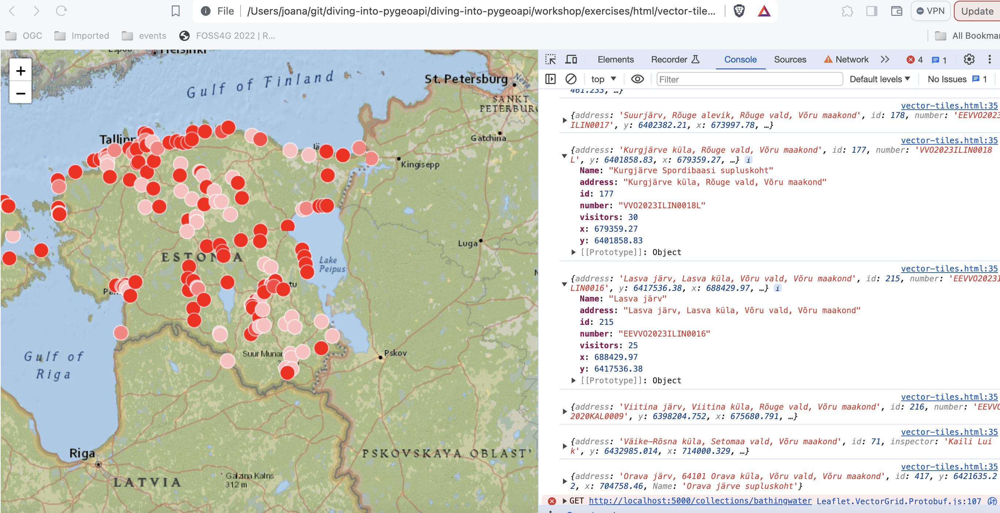

# Exercício 5 - Tiles de dados geoespaciais via OGC API - Tiles

A [OGC API - Tiles](https://ogcapi.ogc.org/tiles) fornece uma API Web para disponibilizar tiles (ou mosaicos) de informação geoespacial. São suportadas diferentes formas de informação geoespacial, como tiles de elementos vetoriais ("vector tiles"), coverages, mapas (ou imagens) e, potencialmente, outros tipos de tiles de informação geoespacial. O standard está disponível neste documento:
 
* [OGC API - Tiles: Parte 1: Core](https://docs.ogc.org/is/20-057/20-057.html)

!!! note
    A OGC API - Tiles estende a estrutura de URL `collections/*` (os conjuntos de tiles são listados em `/collections/example/tiles`:

    ```
    https://demo.pygeoapi.io/collections/lakes/tiles/WebMercatorQuad/{tileMatrix}/{tileRow}/{tileCol}?f=mvt
    ```

## Suporte da pygeoapi

A pygeoapi suporta a especificação core da OGC API - Tiles e é capaz de anunciar um conjunto de tiles existente. Note que a própria pygeoapi não renderiza tiles a partir de dados de origem, mas suporta a publicação de tiles de diferentes [fornecedores de backend](https://docs.pygeoapi.io/en/latest/data-publishing/ogcapi-tiles.html#providers). 

!!! note

    A estrutura de URL da OGC API - Tiles é compatível com camadas XYZ em bibliotecas comuns como OpenLayers, Leaflet e MapML.

!!! note

    Consulte [a documentação oficial](https://docs.pygeoapi.io/en/latest/data-publishing/ogcapi-tiles.html) para mais informações sobre os backends de tiles suportados.

!!! note

    A pygeoapi atualmente suporta dois Tile Matrix Sets muito conhecidos: `WorldCRS84Quad` e `WebMercatorQuad`. A sua definição é publicada no ponto de extremidade [/TileMatrixSets](https://demo.pygeoapi.io/master/TileMatrixSets).

## Publicar tiles vetoriais pré-renderizadas

Neste cenário, as tiles devem ser pré-renderizadas antes de serem servidas. O fornecedor `MVT-tippecanoe` permite servir tiles pré-renderizadas pelo [tippecanoe](https://github.com/mapbox/tippecanoe), seja a partir de uma directoria no disco ou de um servidor estático (ex.: bucket S3 ou MinIO).

Para este exercício, irá publicar um conjunto de dados vetoriais dos [limites dos bairros da corporação municipal da grande Hyderabad](https://en.wikipedia.org/wiki/Administrative_divisions_of_Hyderabad), a partir da localização abaixo:

* data: `workshop/exercises/data/hyderabad/greater_hyderabad_municipal_corporation_ward_Boundaries.geojson`
  
Como primeiro passo vamos gerar as tiles, usando o tippecanoe:

!!! example "Usar o tippecanoe para gerar tiles vetoriais"

    === "Linux/Mac"
    
        <div class="termy">
        ```bash
        cd workshop/exercises
        docker run -it --rm -v $(pwd)/data:/data emotionalcities/tippecanoe \
        tippecanoe -r1 -pk -pf --output-to-directory=/data/tiles/ --force --maximum-zoom=16 \
        --extend-zooms-if-still-dropping --no-tile-compression /data/hyderabad/greater_hyderabad_municipal_corporation_ward_Boundaries.geojson
        ```
        </div>
     
    === "Windows (PowerShell)"
    
        <div class="termy">
        ```bash
        cd workshop/exercises
        docker run -it --rm -v ${pwd}/data:/data emotionalcities/tippecanoe tippecanoe -r1 -pk -pf --output-to-directory=/data/tiles/ --force --maximum-zoom=16 --extend-zooms-if-still-dropping --no-tile-compression /data/hyderabad/greater_hyderabad_municipal_corporation_ward_Boundaries.geojson
        ```
        </div>
 
!!! note
    Por favor, note que a ferramenta tippecanoe requer que o ficheiro de entrada esteja em WGS84, e produz sempre tiles em WebMercator.

!!! question "Atualizar a configuração da pygeoapi"

    Abra a configuração da pygeoapi num editor de texto. Adicione uma nova secção de conjunto de dados da seguinte forma:

``` {.yaml linenums="1"}
    hyderabad:
        type: collection
        title: Greater Hyderabad Municipal Corporation ward boundaries
        description: The city ward boundaries represent the administrative and electoral boundary areas of the city. It plays a great role in planning of the city, for each council of the municipal corporation.
        keywords:
           - Boundaries
           - Administrative
           - Ward
        links:
            - type: text/html
              rel: canonical
              title: information
              href: https://livingatlas-dcdev.opendata.arcgis.com/datasets/a090c89d52f1498f96a82e97b8bfb83e_0/about
              hreflang: en-US
        extents:
            spatial:
                bbox: [78.2379194985166180,17.2908061510471995,78.6217049083810764,17.5618443356918768]
                crs: http://www.opengis.net/def/crs/OGC/1.3/CRS84
            temporal:
                begin: 2011-11-11
                end: null  # or empty
        providers:
            - type: feature
              name: GeoJSON
              data: /data/hyderabad/greater_hyderabad_municipal_corporation_ward_Boundaries.geojson
              id_field: objectid
            - type: tile
              name: MVT-tippecanoe
              data: /data/tiles/  # local directory tree
              options:
                zoom:
                    min: 0
                    max: 16
              format:
                    name: pbf
                    mimetype: application/vnd.mapbox-vector-tile
```

Guarde o ficheiro e reinicie o Docker Compose. Navegue para <http://localhost:5000/collections> para avaliar se o novo conjunto de dados foi publicado.

Verificação adicional para os seguintes endpoints específicos de tiles na coleção `hyderabad`:

- links de tiles em <http://localhost:5000/collections/hyderabad/tiles>
- metadados de tiles em <http://localhost:5000/collections/hyderabad/tiles/WebMercatorQuad/metadata>


## Publicar tiles vetoriais a partir do Elasticsearch

O Elasticsearch fornece um middleware que [renderiza um índice dinamicamente, como tiles vetoriais](https://www.elastic.co/blog/introducing-elasticsearch-vector-tile-search-api-for-geospatial). Este middleware também é suportado pelo backend mvt da pygeoapi.

Se quiser explorar a publicação de tiles vetoriais usando o Elasticsearch, clone o repositório [pygeoapi-examples](https://github.com/geopython/pygeoapi-examples/):

=== "Linux/Mac"

    <div class="termy">
    ```bash
    git clone https://github.com/geopython/pygeoapi-examples.git
    ```
    </div>

=== "Windows (PowerShell)"

    <div class="termy">
    ```bash
    git clone https://github.com/geopython/pygeoapi-examples.git
    ```
    </div>
Depois, mude para a pasta `docker/mvt-elastic`:

=== "Linux/Mac"

    <div class="termy">
    ```bash
    cd docker/mvt-elastic
    ```
    </div>

=== "Windows (PowerShell)"

    <div class="termy">
    ```bash
    cd docker/mvt-elastic
    ```
    </div>

Edite o script `add-data.sh` na pasta `ES`, adicionando estas duas linhas antes do fim:

``` {.yaml linenums="1"}

    curl -o /tmp/hyderabad.geojson https://raw.githubusercontent.com/geopython/diving-into-pygeoapi/refs/heads/main/workshop/exercises/data/hyderabad/greater_hyderabad_municipal_corporation_ward_Boundaries.geojson
    python3 /load_es_data.py /tmp/hyderabad.geojson objectid

```

Acima, estamos a descarregar o `greater_hyderabad_municipal_corporation_ward_Boundaries.geojson` para dentro do container e a ingeri-lo num índice do Elasticsearch. Depois disto, precisamos de construir a imagem docker:

=== "Linux/Mac"

    <div class="termy">
    ```bash
    docker compose build
    ```
    </div>

=== "Windows (PowerShell)"

    <div class="termy">
    ```bash
    docker compose build
    ```
    </div>

Edite a configuração `docker.config.yml` na pasta `pygeoapi`, adicionando este bloco de código antes do fim:

``` {.yaml linenums="1"}
    hyderabad:
        type: collection
        title: Limites dos bairros da Corporação Municipal da Grande Hyderabad
        description: Os limites dos bairros da cidade representam as áreas de fronteira administrativa e eleitoral da cidade. Desempenha um grande papel no planeamento da cidade, para cada conselho da corporação municipal.
        keywords:
           - Limites
           - Administrativo
           - Bairro
        links:
            - type: text/html
              rel: canonical
              title: informação
              href: https://livingatlas-dcdev.opendata.arcgis.com/datasets/a090c89d52f1498f96a82e97b8bfb83e_0/about
              hreflang: en-US
        extents:
            spatial:
                bbox: [78.2379194985166180,17.2908061510471995,78.6217049083810764,17.5618443356918768]
                crs: http://www.opengis.net/def/crs/OGC/1.3/CRS84
            temporal:
                begin: 2011-11-11
                end: null  # ou vazio
        providers:
            - type: feature
              name: Elasticsearch
              #Nota: elastic_search é o container de docker do ES, o nome é definido no docker-compose.yml
              data: http://elastic_search:9200/hyderabad
              id_field: objectid
            - type: tile
              name: MVT-elastic
              data: http://elastic_search:9200/hyderabad/_mvt/geometry/{z}/{x}/{y}?grid_precision=0
              # o índice deve ter um geo_point
              options:
                zoom:
                    min: 0
                    max: 29
              format:
                    name: pbf
                    mimetype: application/vnd.mapbox-vector-tile
```

Esta configuração permite a publicação do `greater_hyderabad_municipal_corporation_ward_Boundaries.geojson` como OGC API - Features e OGC API - Tiles.

!!! note
    A API de pesquisa de tiles vetoriais do Elastic suporta níveis de zoom de 0 a 29.

Finalmente, inicie a composição docker, que irá descarregar e ingerir o conjunto de dados e publicá-lo na pygeoapi:

=== "Linux/Mac"

    <div class="termy">
    ```bash
    docker compose up
    ```
    </div>

=== "Windows (PowerShell)"

    <div class="termy">
    ```bash
    docker compose up
    ```
    </div>

!!! note

    Pode verificar o seu índice elastic em:
    [http://localhost:9200/_cat/indices](http://localhost:9200/_cat/indices)

    Se estiver em produção, poderá querer fechar as portas do elastic no docker-compose.

## Acesso do lado do cliente

### QGIS

O QGIS suporta tiles Vetoriais da OGC API através da [Camada de tiles Vetoriais](https://docs.qgis.org/3.40/en/docs/user_manual/working_with_vector_tiles/vector_tiles_properties.html). Embora a OGC API - Tiles não seja suportada nativamente, pode personalizar a `ligação genérica` para aceder a eles no QGIS.

!!! question "Aceder a tiles Vetoriais da OGC API a partir do QGIS"

    Antes de entrar no QGIS, aceda à página de instalação da sua pygeoapi no navegador e siga estes passos.

    - aceda à página da coleção do conjunto de dados de tiles: <http://localhost:5000/collections/hyderabad>
    - navegue para a página de tiles clicando em `tiles`: <http://localhost:5000/collections/hyderabad/tiles>
    - clique em `Tileset Metadata`: <http://localhost:5000/collections/hyderabad/tiles/WebMercatorQuad/metadata>
    - Tome nota do URL template: `http://localhost:5000/collections/hyderabad/tiles/WebMercatorQuad/{tileMatrix}/{tileRow}/{tileCol}?f=mvt` e os valores de minZoom e maxZoom

    Siga estes passos para se ligar a um serviço e aceder a tiles vetoriais:

    - localize o serviço de tiles vetoriais no painel do navegador do lado esquerdo. Note que também pode usar o menu superior e navegar para `Layer > Adicionar Layer > Adicionar Layer de Tiles Vetoriaiss`

    - clique com o botão direito para abrir o menu de contexto e escolha `Nova Ligação Genérica`
    - preencha os valores necessários. Para URL, use o URL que anotou no passo anterior, substituindo `{tileMatrix}/{tileRow}/{tileCol}` por `{z}/{y}/{x}`.

    { width=100% }

    - pressione `OK` para adicionar o serviço. Neste ponto, deverá ver a ligação aparecer. Clique em `Adicionar` para a adicionar ao mapa
    - Faça zoom para Hyderabad para visualizar o seu conjunto de dados

    { width=100% }

    { width=100% }

### LeafletJS

O [LeafletJS](https://leafletjs.com) é uma biblioteca JavaScript popular para adicionar mapas interativos a websites. O LeafletJS não suporta explicitamente as OGC APIs, no entanto, pode interagir com a OGC API usando diretamente os resultados da API.

!!! question "Adicionar OGC API - Tiles a um website com LeafletJS"

    * copie o HTML abaixo para um ficheiro chamado `vector-tiles.html`, ou localize este ficheiro em `workshop/exercises/html`
    * abra o ficheiro num navegador web

    O código usa a biblioteca LeafletJS com o plugin [leaflet.vectorgrid](https://github.com/Leaflet/Leaflet.VectorGrid) para exibir o serviço OGC API - Tiles de Hyderabad sobre um layer de base.

``` {.html linenums="1"}
<html>
<head><title>Exercício OGC API - Tiles</title></head>
<body>
<div id="map" style="width:100vw;height:100vh;"></div>
<link rel="stylesheet" href="https://unpkg.com/leaflet@1.0.3/dist/leaflet.css" />
<script type="text/javascript" src="https://unpkg.com/leaflet@1.3.1/dist/leaflet.js"></script>
<script type="text/javascript" src="https://unpkg.com/leaflet.vectorgrid@1.3.0/dist/Leaflet.VectorGrid.bundled.js"></script>
<script>    
map = L.map('map').setView({ lat: 17.425181, lng: 78.5493906 }, 11);
map.addLayer(
    new L.tileLayer('https://server.arcgisonline.com/ArcGIS/rest/services/NatGeo_World_Map/MapServer/tile/{z}/{y}/{x}', {
    attribution: 'Tiles &copy; Esri &mdash; National Geographic, Esri, DeLorme, NAVTEQ, UNEP-WCMC, USGS, NASA, ESA, METI, NRCAN, GEBCO, NOAA, iPC',
    minZoom: 1,
    maxZoom: 16,
    }));
 function getColor(val){
    if (val < 40) {return "#f2e6c7"}
    else if (val < 80) {return "#8fa37e"}
    else if (val < 100) {return "#f0d17d"}
    else if (val < 120) {return  "#d7ded1"}
    else return "#c2d0d9";
 }
 var vectorTileStyling = {
    greater_hyderabad_municipal_corporation_ward_Boundaries: function(properties) {
        return ({
            fill: true,
            fillColor: getColor(properties.objectid),
            color: "#ffffff",
            fillOpacity: 1.0,
            weight: 5,
            //color: "#ffffff",
            opacity: 1.0,
        });
    }
} 
    var mapVectorTileOptions = {
        rendererFactory: L.canvas.tile,
        interactive: true,
        vectorTileLayerStyles: vectorTileStyling,
        };
    var pbfURL='http://localhost:5000/collections/hyderabad/tiles/WorldCRS84Quad/{z}/{y}/{x}?f=mvt';
    var pbfLayer=L.vectorGrid.protobuf(pbfURL,mapVectorTileOptions).on('click',function(e) {
        console.log(e.layer);
    L.DomEvent.stop(e);
    }).addTo(map); 
</script>
</body>
</html>
```

Neste exemplo, as cores dos símbolos refletem o valor do atributo `objectid`.

  { width=100% }

!!! note 

    Pode verificar os atributos do layer, abrindo a consola nas ferramentas de developer.
    { width=100% }


!!! tip 
    Tente adicionar um [layer de tiles vetoriais da pygeoapi diferente](https://demo.pygeoapi.io/master/collections/lakes/tiles/WorldCRS84Quad/metadata) atualizando o código em `workshop/exercises/html/vector-tiles.html`.

    Se quiser renderizar as tiles do [exemplo do Elasticsearch](#publish-vector-tiles-from-elasticsearch), pode consultar o código deste repositório [aqui](https://github.com/doublebyte1/vtiles-example/blob/ogcapi-ws/demo-oat.htm):

    === "Linux/Mac"

        <div class="termy">
        ```bash
        git clone -b ogcapi-ws https://github.com/emotional-cities/vtiles-example.git
        ```
        </div>

    === "Windows (PowerShell)"

        <div class="termy">
        ```bash
        git clone -b ogcapi-ws https://github.com/emotional-cities/vtiles-example.git
        ```
        </div>

    { width=100% }

!!! tip 

    Consulte a [documentação oficial da LeafletJS](https://leafletjs.com/reference.html)


### OpenLayers

O [OpenLayers](https://openlayers.org) é uma biblioteca JavaScript popular para adicionar mapas interativos a websites. O OpenLayers suporta nativamente a OGC API - Tiles (mapa e vetor). Pode verificar o código para o exemplo abaixo em: <https://ogcincubator.github.io/ogcapi-tiles-demo/>

<iframe
  src="https://ogcincubator.github.io/ogcapi-tiles-demo/"
  style="width:100%; height:800px;"
></iframe>

!!! tip 

    Consulte a [documentação oficial do OpenLayers](https://openlayers.org/en/latest/examples/ogc-vector-tiles.html)


# Resumo

Parabéns! Agora é capaz de publicar tiles na pygeoapi. Pode aprender mais sobre este Standard em: <https://tiles.developer.ogc.org/>