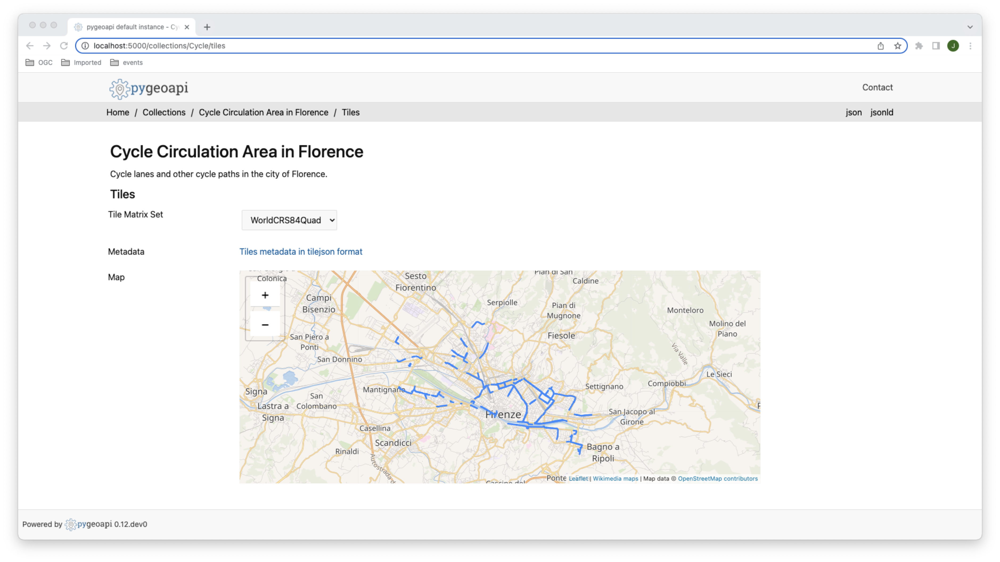
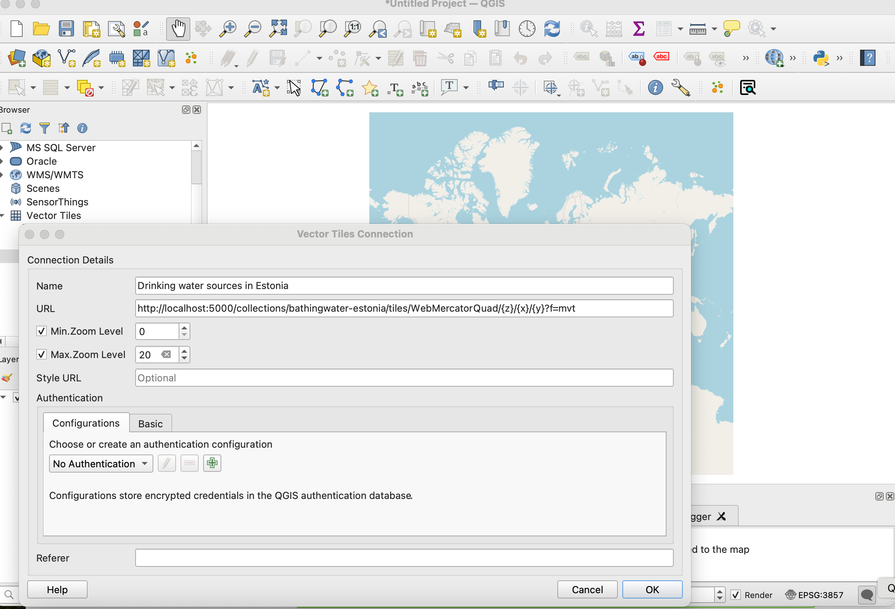
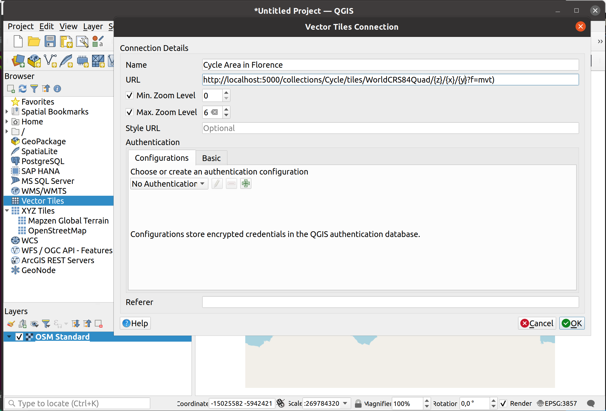
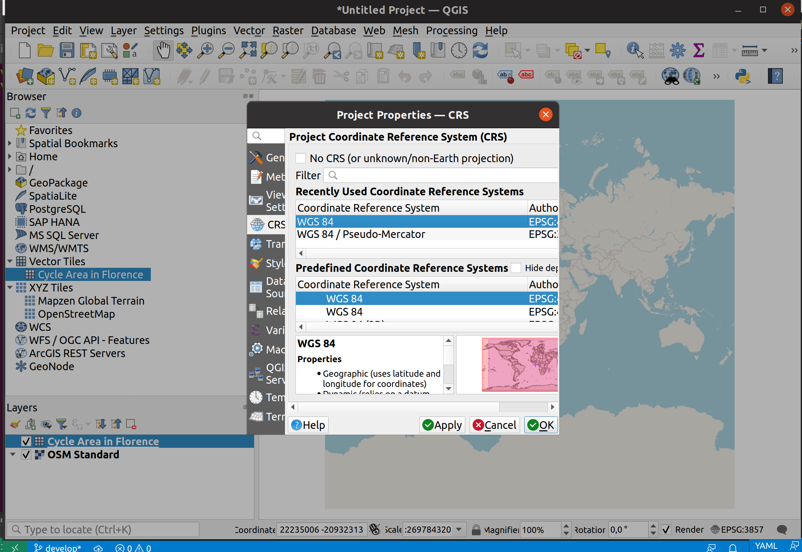
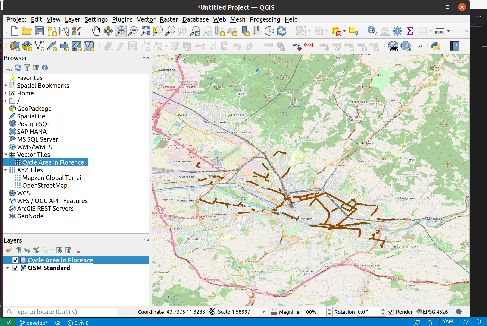

# Exercise 4 - Tiles of geospatial data via OGC API - Tiles

[OGC API - Tiles](https://ogcapi.ogc.org/tiles) provides a Web API to deliver tiled data (bitmaps or vectors),
extending the functionalty other OGC API standards:
 
* [OGC API - Tiles: Part 1: Core](https://docs.ogc.org/DRAFTS/20-057.html) (**draft**)

!!! note
    OGC API - Tiles extends the `collections/*` URL structure (tilesets are listed under `/collections/example/tiles`:

    ```
    https://demo.pygeoapi.io/collections/lakes/tiles/WorldCRS84Quad/{tileMatrix}/{tileRow}/{tileCol}?f=mvt
    ```

## pygeoapi support

pygeoapi supports the core OGC API - Tiles specification, and is able to advertise an existing tileset. Note that pygeoapi
itself does not render tiles from source data (tiles must be pre-rendered before serving). Existing tools to create tiles
include, but are not limited to:

* [TileMill](https://tilemill-project.github.io/tilemill)
* [MapProxy](https://mapproxy.org)
* [QGIS](https://www.qgistutorials.com/en/docs/creating_basemaps_with_qtiles.html)
* [tippecanoe](https://github.com/mapbox/tippecanoe):

!!! The OGC API - Tiles URL structure is compatible with XYZ layers in common libraries such as OpenLayers, Leaflet and MapML

!!! note

    See [the official documentation](https://docs.pygeoapi.io/en/latest/data-publishing/ogcapi-tiles.html) for more information on supported tile backends

## Publish a tile dataset

For this exercise, you will publish a vector dataset of cycle paths, from the city of Florence, from the locations below:

* data: `workshop/exercises/data/cycle-lanes-firenze.geojson`
* metadata: `workshop/exercises/data/cycle-lanes-firenze.qmd`

Let's generate the tiles as the first step using tippecanoe:

<div class="termy">
```bash
cd workshop/exercises
docker run -it --rm -v ${PWD}/data:/data emotionalcities/tippecanoe \
tippecanoe --output-to-directory=/data/tiles/ --force --maximum-zoom=16 --drop-densest-as-needed --extend-zooms-if-still-dropping --no-tile-compression /data/cycle-lanes-firenze.geojson
```
</div>
 
!!! question "Update the pygeoapi configuration"

    Open the pygeoapi configuration in a text editor. Add a new dataset section as follows:

    ``` {.yaml linenums="1"}
        Cycle:
            type: collection
            title: Cycle Circulation Area in Florence 
            description: Cycle lanes and other cycle paths in the city of Florence.
            keywords:
                - cycle
            links:
                - type: text/html
                  rel: canonical
                  title: information
                  href: http://opendata.comune.firenze.it/?q=metarepo/datasetinfo&id=52d8d3ab-eae5-400e-8561-d974f8612de0
                  hreflang: en-US
            extents:
                spatial:
                    bbox: [-180,-90,180,90]
                    crs: http://www.opengis.net/def/crs/OGC/1.3/CRS84
                temporal:
                    begin: 2011-11-11
                    end: null  # or empty
            providers:
                - type: feature
                  name: GeoJSON
                  data: /data/cycle-lanes-firenze.geojson
                  #id_field: accicid
                - type: tile
                  name: MVT
                  data: /data/tiles
                  #data: tests/data/tiles/DATASET
                  options:
                      metadata_format: tilejson # default | tilejson
                      bounds: [[11.1861935050234251,43.7512761718001855],[11.3125196304517655,43.8129406631082645]]
                      zoom:
                          min: 0
                          max: 16
                      schemes:
                          - WorldCRS84Quad
                  format:
                      name: pbf
                      mimetype: application/vnd.mapbox-vector-tile
    ```

Save the file and restart docker compose. Navigate to `http://localhost:5000/collections` to evaluate whether the new dataset has been published.

Additional check for the following tile specific endpoints in the `Cycle` collection:

- tile links in [http://localhost:5000/collections/Cycle](http://localhost:5000/collections/Cycle
- tile metadata in [http://localhost:5000/collections/Cycle/tiles/WorldCRS84Quad/metadata](http://localhost:5000/collections/Cycle/tiles/WorldCRS84Quad/metadata)



## Client access

### QGIS

QGIS supports OGC API Vector Tiles via the [Vector Tiles Layer](https://docs.qgis.org/3.22/en/docs/user_manual/working_with_vector_tiles/vector_tiles_properties.html). Although OGC API - Tiles are not natively supported, you can customize the `generic connection` in order to access them in QGIS.

!!! question "Access OGC API Vector Tiles from QGIS"

    Before entering QGIS, access your pygeoapi installation page on the browser and follow these steps.

    - access the collection page of the tiles dataset: `http://localhost:5000/collections/Cycle`
    - navigate to the tiles page by clicking on `tiles`: `http://localhost:5000/collections/Cycle/tiles`
    - click in `Tiles metadata in tilejson format`: `http://localhost:5000/collections/Cycle/tiles/WorldCRS84Quad/metadata`
    - note the URL in `tiles`: `http://localhost:5000/collections/Cycle/tiles/WorldCRS84Quad/{tileMatrix}/{tileRow}/{tileCol}?f=mvt` and of the values of minZoom and maxZoom

    Follow these steps to connect to a service and access vector tiles:

    - locate the vector tiles service on the left hand side browser panel. Note that you can also use the top menu and navigate to `Layer > Add Layer > Vector Tile Layer`

    { width=100% }

    - right-click to bring up the context menu and choose `New Generic connection`
    - fill the required values. For URL, use the URL you noted from the previous step, replacing `{tileMatrix}/{tileRow}/{tileCol}` with `{z}/{x}/{y}`.
    - press `OK` to add the service. At this point, if you are using the browser you should see the collection appearing in the menu, below "Vector Tiles"
    - double-click in the collection to add it to the map
    - remember to set the CRS of the map to `EPSG:4326` by clicking in the button on the lower right corner
    - zoom in to Florence to visualize your dataset

    { width=100% }
    { width=100% }
    { width=100% }

### LeafletJS

[LeafletJS](https://leafletjs.com) is a popular JavaScript library to add interactive maps to websites. LeafletJS does not support OGC API's explicitely, however can interact with OGC API by using the results of the API directly.

!!! question "Add OGC API - Tiles to a website with LeafletJS"

    * copy the HTML below to a file called `vector-tiles.html`, or locate this file in `workshop/exercises/html`
    * open the file in a web browser

    The code uses the LeafletJS library with the [leaflet.vectorgrid](https://github.com/Leaflet/Leaflet.VectorGrid) plugin to display the lakes OGC API - Tiles service on top of an OpenStreetMap base layer.

    ``` {.html linenums="1"}
    <html>
    <head><title>OGC API - Tiles exercise</title></head>
    <body>
    <div id="map" style="width:100vw;height:100vh;"></div>
    <link rel="stylesheet" href="https://unpkg.com/leaflet@1.0.3/dist/leaflet.css"/>
    <script type="text/javascript" src="https://unpkg.com/leaflet@1.3.1/dist/leaflet.js"></script>
    <script type="text/javascript" src="https://unpkg.com/leaflet.vectorgrid@1.2.0"></script>
    <script>
    map = L.map('map').setView({ lat: 43.79, lng: 11.25 }, 12);
    map.addLayer(
        new L.tileLayer('https://stamen-tiles-{s}.a.ssl.fastly.net/watercolor/{z}/{x}/{y}.{ext}', {
        attribution: 'Map tiles by <a href="https://stamen.com">Stamen Design</a>, <a href="https://creativecommons.org/licenses/by/3.0">CC BY 3.0</a> &mdash; Map data &copy; <a href="https://www.openstreetmap.org/copyright">OpenStreetMap</a> contributors',
        subdomains: 'abcd',
        minZoom: 1,
        maxZoom: 16,
        ext: 'jpg'
        }));
    map.addLayer(new L.vectorGrid.protobuf(
        'http://localhost:5000/collections/Cycle/tiles/WorldCRS84Quad/{z}/{x}/{y}?f=mvt', 
        { rendererFactory: L.canvas.tile }));
    </script>
    </body>
    </html>
    ```

   { width=100% }

!!! tip 
    Try adding a [different pygeoapi vector tiles layer](https://demo.pygeoapi.io/master/collections/lakes/tiles/WorldCRS84Quad/metadata) by updating the code in `workshop/exercises/html/vector-tiles.html`.

### OpenLayers

[OpenLayers](https://openlayers.org) is a popular JavaScript library to add interactive maps to websites. OpenLayers natively supports OGC API - Tiles.

!!! tip 

    See the [official OpenLayers documentation](https://openlayers.org/en/latest/examples/ogc-vector-tiles.html)


# Summary

Congratulations! You are now able to publish tiles to pygeoapi.
