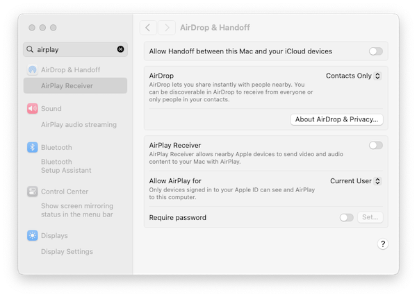

# Workshop environment setup
 
In this workshop we use the following materials:

1. **Documentation** - (like this page): access latest on [dive.pygeoapi.io](https://dive.pygeoapi.io)
1. **Exercises** - download the [latest zip file](https://github.com/geopython/diving-into-pygeoapi/archive/refs/heads/main.zip), unzip, find exercises in `workshop/exercises` [^1]
1. **Docker** - all examples/exercises are run in a `Docker container` in `workshop/exercises`

[^1]: alternatively, you can fork/clone the GitHub repository of this workshop directly from https://github.com/geopython/diving-into-pygeoapi.

## Text editor

Your text editor needs to be able to edit configuration files in **plain text**. Below are some choices
for text editors (there may be others), along with what some of the pygeoapi developers prefer to use:

* Notepad or Notepad++ (Windows)
* Sublime Text: Angelos
* PyCharm: Just
* Emacs: Just
* Visual Studio Code: Francesco, Angelos, Joana
* `vi` / `vim`: Tom, Angelos

Having said this, please feel free to use what works for you :)

## YAML

Most exercises will focus on editing the pygeoapi [configuration](https://docs.pygeoapi.io/en/latest/configuration.html),
which is in the [YAML](https://yaml.org) format. If you are not familiar with YAML, it is worth reading through a [tutorial](https://www.cloudbees.com/blog/yaml-tutorial-everything-you-need-get-started) to become aware of YAML syntax and indentation.

The main requirement for the training is to install Docker and/with Docker Compose on your system.
We strongly advise to install Docker before the workshop starts.

Although several custom installation scenarios are possible (see the [documentation](https://docs.pygeoapi.io/en/latest/installation.html)
for more information), these are not considered in this workshop given the ability to install a fully reproducible
environment via Docker and Docker Compose.

Workshop Exercises will also be based on Docker, hence a custom installation would at least be 'challenging'.
The good news is that only a single installation (Docker) is needed! The Docker images used in this workshop
contain the latest pygeoapi and all its dependencies and external services (e.g. PostGIS).

## About Docker

Docker has been available for almost 10 years, and provided as a deployment option on numerous FOSS software and OSGeo projects. Given the current
era of computing, chances are that you have heard of Docker and *containerization*. Or, perhaps are already familiar and hopefully using Docker already.
If not, there is an abundance of introductory materials that can be found online like this [tutorial from IBM](https://www.ibm.com/topics/docker).

FOSS4G software has benefitted greatly from Docker (consistent packaging, isolation, integration and upgrade patterns) in
comparison to custom installations. Though today we mainly use Docker, the bigger picture is the use of **Containers** as a next step
in virtualization. Containerization certainly deserves its own workshop, so for the purpose of this workshop we only cover the basics
of Docker and Docker Compose.

[Docker Compose](https://docs.docker.com/compose) is an addition to Docker to facilitate
the orchestration (configuration) of one or more Docker 'Containers' (a Container is a running instance of a Docker image)
using a configuration convention (the Docker Compose YAML file), usually named `docker-compose.yml`.

Stepping up further are even more sophisticated Docker orchestrators like 
[Rancher](https://rancher.com/products/rancher) and [Kubernetes](https://kubernetes.io), but for
this workshop, Docker and Docker Compose are all we need.

## Installation

Docker installation has greatly progressed over the years. This is the only part of the workshop
which is dependent on the system/OS you are running (e.g. Windows, Mac or Linux). For each
system the Docker website provides detailed installation instructions. Please follow these consistently.

For many platforms a product called `Docker Desktop` is available, which includes the main Docker components:

* Windows [installation](https://docs.Docker.com/desktop/install/windows-install)
* Mac [installation](https://docs.Docker.com/desktop/install/mac-install)
* Linux [installation](https://docs.Docker.com/desktop/install/linux-install)

Some notes:

* On Windows we recommend using the [Windows Subsystem for Linux](https://docs.microsoft.com/en-us/windows/wsl) (WSL) as it also provides a powerful (Bash) command line and has optimal integration with Docker
* On Mac, if you are using [Homebrew](https://brew.sh), consider (as the author has) using the [brew Docker formula](https://formulae.brew.sh/formula/Docker)
* On Mac OSX Monterey and later, there may be an issue with local port 5000 already in use, therefore conflicting with the default one used by the pygeoapi container. If you see this error `OSError: [Errno 48] Address already in use`, you need to disable the *Airplay Receiver*. Go to `System Settings | Sharing` or like in Sonoma type 'airplay' in the search box. See image below for Mac OSX Sonoma. Also a detailed description in [this blog post](https://progressstory.com/tech/port-5000-already-in-use-macos-monterey-issue/).

* On Linux, you can choose the relevant installer for your platform. You can also use Virtualbox with a Ubuntu Image or use a cloud VM
* Docker Desktop includes a graphical user interface with some interesting options. You can see logs and information about running containers, open their service in a browser or even open a terminal inside the container

If all goes well, you should be able to run Docker from the command line as follows: [^2]

<div class="termy">
```bash
docker --version
Docker version 20.10.17, build 100c701

docker compose --version  
Docker Compose version v2.6.1
```
</div>

(It is not required that your version numbers exactly match).
[^2]: For recent version of Docker run `docker compose version`


## Quickstart

Once Docker is available on your system, running the pygeoapi container with its built-in configuration and 
data is a one-liner. 

!!! question "First run via Docker"

    Open a terminal session and run:

    <div class="termy">
    ```bash
    docker run --rm -p 5000:80 geopython/pygeoapi:latest
    Unable to find image 'geopython/pygeoapi:latest' locally
    latest: Pulling from geopython/pygeoapi
    d7bfe07ed847: Already exists 
    d5d0144a7164: Already exists 
    afe0923a0fa0: Already exists 
    75f8618c4e86: Already exists 
    c603397fd6ad: Already exists 
    6584a95328b3: Already exists 
    fd93e44631d9: Already exists 
    6a3201071a5d: Already exists 
    4f4fb700ef54: Already exists 
    Digest: sha256:27b2b219497a6ea382a946ee90ae96ad00b5c1d8e9b725fccf23211978fef124
    Status: Downloaded newer image for geopython/pygeoapi:latest
    START /entrypoint.sh
    Trying to generate openapi.yml
    openapi.yml generated continue to pygeoapi
    make SCRIPT_NAME empty from /
    Start gunicorn name=pygeoapi on 0.0.0.0:80 with 4 workers and SCRIPT_NAME=
    [2022-08-09 12:59:00 +0000] [1] [INFO] Starting gunicorn 20.0.4
    [2022-08-09 12:59:00 +0000] [1] [INFO] Listening at: http://0.0.0.0:80 (1)
    [2022-08-09 12:59:00 +0000] [1] [INFO] Using worker: gevent
    [2022-08-09 12:59:00 +0000] [18] [INFO] Booting worker with pid: 18
    [2022-08-09 12:59:00 +0000] [19] [INFO] Booting worker with pid: 19
    [2022-08-09 12:59:00 +0000] [21] [INFO] Booting worker with pid: 21
    [2022-08-09 12:59:00 +0000] [22] [INFO] Booting worker with pid: 22
    ```
    </div>


That's all! Open your browser and navigate to `http://localhost:5000`, the pygeoapi page will display.
As part of the initial `docker run`, Docker will download the pygeoapi Docker Image from [Docker hub](https://hub.Docker.com/r/geopython/pygeoapi).
This may take some time, as the Docker image includes all dependencies (such as GDAL, etc.). Be patient! This is a one-time download for the entire workshop, or
you may want to do this beforehand. 

Some notes:

* Docker runs a pygeoapi container on your local system on port 5000, which is mapped to port 80 inside the container
* the pygeoapi Docker container runs with the [default configuration](https://github.com/geopython/pygeoapi/blob/master/docker/default.config.yml) and data from the GitHub repo 
* both configuration and data (from GitHub repo) is embedded in the Docker Image - we will override these later
* the `--rm` option removes the Docker Container (but not the image), after execution
* type `CTRL-C` to stop the container and return to the terminal

Next, you can override the default configuration and add your own data using [Docker volumes](https://docs.Docker.com/storage/volumes).

## Customizing configuration

In the upcoming exercises we are going to update the configuration file multiple times.
For ease of development we are overriding the pygeoapi configuration which resides by default at `/pygeoapi/local.config.yml`
within the container by a local file which you can edit in your favourite text editor. 

!!! question "Override the pygeoapi config file"

    Download pygeoapi's default Docker configuration from [default.config.yml](https://raw.githubusercontent.com/geopython/pygeoapi/master/docker/default.config.yml) to the current folder (or navigate to the folder where you downloaded the file), for example with:

    <div class="termy">
    ```bash
    curl -O https://raw.githubusercontent.com/geopython/pygeoapi/master/docker/default.config.yml
    ```
    </div>

    Open the file in your favourite text editor and change the title and description of the API:

    ``` {.yml linenums="59"}
    metadata:
        identification:
            title: My first pygeoapi run
            description: pygeoapi provides an API to geospatial data
    ```

    Now run the container with the overridden config file:

    <div class="termy">
    ```bash
    docker run -p 5000:80 \
    -v $(pwd)/default.config.yml:/pygeoapi/local.config.yml \
    geopython/pygeoapi:latest
    ```
    </div>

    At this point, navigate to `http://localhost:5000` to verify the new title and description.


By using a Docker volume mount (`-v` option), Docker attaches or 'mounts' a
directory or single file from your host/local system into the Docker Container.

In the above snippet, `$(pwd)` indicates the working folder from which you start the Docker container.

## Adding data and setting the configuration file

In addition to adapting the configuration you will usually add your own data as files or
remote data services like PostGIS or WFS.

You can also mount a local directory such as `data/` to `/pygeoapi/mydata` within the Container.
Within the data directory you can store vector data, raster files or sets of image of vector tiles.

Below is an example where the configuration is explictly set to `pygeoapi-config.yml` via an environment variable (`-e`) and uses a Docker mount to mount the local `data` folder as `/pygeoapi/mydata`:

<div class="termy">
```bash
docker run -p 5000:80 \
-v $(pwd)/data:/pygeoapi/mydata \
-v $(pwd)/default.config.yml:/pygeoapi/pygeoapi-config.yml \
-e PYGEOAPI_CONFIG=/pygeoapi/pygeoapi-config.yml \
geopython/pygeoapi:latest
```
</div>

In the next sections we will review additional examples of mounts to the data folder. More Docker deployment examples can be found in the [pygeoapi GitHub repository](https://github.com/geopython/pygeoapi/tree/master/docker/examples).

## Using Docker for Python Clients

In some exercises we access `pygeoapi` remote endpoints using [OWSLib](https://owslib.readthedocs.io), 
a Python library to interact with OGC Web Services. `OWSLib` can be installed using standard 
Python `pip3 install OWSLib`, but you may not have Python available, or you want to keep your system 'clean'.

As Docker is already available on your system, you can start up a 
Container with a complete Python environment, and access it from a `bash` shell prompt. 
The magic line is:

`docker run -it --rm --network=host --name owslib python:3.10-slim /bin/bash`

This will pull a small (125MB) official Python Docker Image. When the Container is started you are directed into 
a `Bash` session/prompt. The argument `--network=host` allows you to directly interact with services on your
host system, thus with `pygeoapi`, without setting up a Docker network. From there you can start `python3`, install `OWSLib` and
maybe even other tools like `curl` and `wget`.

Below is a complete example, assuming pygeoapi runs on your `localhost` at port 5000:


<div class="termy">
```bash
docker run -it --rm --network=host --name owslib python:3.10-slim /bin/bash

Unable to find image 'python:3.10-slim' locally
3.10-slim: Pulling from library/python
5b5fe70539cd: Pull complete 
f4b0e4004dc0: Pull complete 
c5424f0ac885: Pull complete 
9d21fe1624ec: Pull complete 
de0194aa1c21: Pull complete 
Digest: sha256:7dc5b4e948acd18c1633b0e593ad0224298646612ce7d0b5ac6d4e17616d7e4b
Status: Downloaded newer image for python:3.10-slim

root@docker-desktop:/# pip3 install owslib
root@docker-desktop:/# python3
>>> from owslib.ogcapi.features import Features
>>> w = Features('http://localhost:5000')
>>> w
<owslib.ogcapi.features.Features object at 0x7ff493e6f850>
>>> conformance = w.conformance()
>>> conformance
etc

```
</div>
 
We will refer to this installation in some of the Exercises where OWSLib is used.
