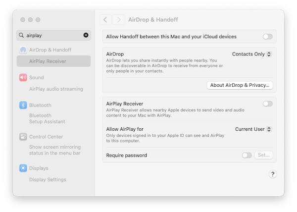

# Configuração do ambiente da workshop
 
Nesta workshop, utilizamos os seguintes materiais:

1. **Documentação** - (como esta página): aceda à versão mais recente em [dive.pygeoapi.io](https://dive.pygeoapi.io)
2. **Exercícios** - descarregue o [ficheiro zip mais recente](https://github.com/geopython/diving-into-pygeoapi/archive/refs/heads/main.zip), extraia o conteúdo e encontre os exercícios em `workshop/exercises` [^1]
3. **Docker** - todos os exemplos/exercícios são executados num `contentor Docker` em `workshop/exercises`

[^1]: Em alternativa, pode fazer um *fork*/clonar o repositório GitHub desta workshop diretamente de <https://github.com/geopython/diving-into-pygeoapi>.

## Editor de Texto

O seu editor de texto deve ser capaz de editar ficheiros de configuração em **texto simples**. Abaixo estão algumas opções de editores de texto (pode haver outros), juntamente com o que alguns dos programadores da pygeoapi preferem usar:

* Notepad ou Notepad++ (Windows)
* Sublime Text: Angelos
* PyCharm: Just
* Emacs: Just
* Visual Studio Code: Francesco, Angelos, Joana
* `vi` / `vim`: Tom, Angelos

Dito isto, sinta-se à vontade para usar o que funciona melhor para si :)

## YAML

A maioria dos exercícios focar-se-á na edição da [configuração](https://docs.pygeoapi.io/en/latest/configuration.html) da pygeoapi, que está no formato [YAML](https://yaml.org). Se não estiver familiarizado com YAML, vale a pena ler um [tutorial](https://www.cloudbees.com/blog/yaml-tutorial-everything-you-need-get-started) para se familiarizar com a sintaxe e a indentação do YAML.

O requisito principal para a formação é instalar o Docker e/ou o Docker Compose no seu sistema.
Aconselhamos vivamente a instalação do Docker antes do início da workshop.

Embora sejam possíveis vários cenários de instalação personalizada (consulte a [documentação](https://docs.pygeoapi.io/en/latest/installation.html) para mais informações), estes não são considerados nesta workshop, dada a capacidade de instalar um ambiente totalmente reprodutível através do Docker e do Docker Compose.

Os Exercícios da Workshop também serão baseados no Docker, pelo que uma instalação personalizada seria, no mínimo, 'desafiadora'.
A boa notícia é que apenas uma única instalação (Docker) é necessária! As imagens Docker utilizadas nesta workshop contêm a versão mais recente da pygeoapi e todas as suas dependências e serviços externos (ex: PostGIS).

## Sobre o Docker

O Docker está disponível desde 2013 e é fornecido como uma opção de implementação em inúmeros projetos de software FOSS e da OSGeo. Dada a era atual da computação, é provável que já tenha ouvido falar do Docker e de *contentorização*. Ou, talvez, já esteja familiarizado e, esperamos, já a utilizar o Docker.
Se não for o caso, existe uma abundância de materiais introdutórios que podem ser encontrados online, como este [tutorial da IBM](https://www.ibm.com/topics/docker).

O software FOSS4G beneficiou enormemente do Docker (padrões consistentes de empacotamento, isolamento, integração e atualização) em comparação com as instalações personalizadas. Embora hoje utilizemos principalmente o Docker, a visão geral é o uso de **Contentores** como o próximo passo na virtualização. A contentorização certamente merece uma workshop própria, portanto, para os fins desta workshop, abordaremos apenas os conceitos básicos do Docker e do Docker Compose.

O [Docker Compose](https://docs.docker.com/compose) é um complemento do Docker para facilitar a orquestração (configuração) de um ou mais 'Contentores' Docker (um Contentor é uma instância em execução de uma imagem Docker) usando uma convenção de configuração (o ficheiro YAML do Docker Compose), geralmente chamado `docker-compose.yml`.

Num patamar superior, existem orquestradores Docker ainda mais sofisticados, como o [Rancher](https://rancher.com/products/rancher) e o [Kubernetes](https://kubernetes.io), mas para esta workshop, o Docker e o Docker Compose são tudo o que precisamos.

## Instalação

A instalação do Docker progrediu muito ao longo dos anos. Esta é a única parte da workshop que depende do sistema/SO que está a utilizar (ex: Windows, Mac ou Linux). Para cada sistema, o site do Docker fornece instruções de instalação detalhadas. Por favor, siga-as de forma consistente.

Para muitas plataformas, está disponível um produto chamado [Docker Desktop](https://docs.docker.com/desktop), que inclui os principais componentes do Docker:

* Instalação para [Windows](https://docs.Docker.com/desktop/install/windows-install)
* Instalação para [Mac](https://docs.Docker.com/desktop/install/mac-install)
* Instalação para [Linux](https://docs.Docker.com/desktop/install/linux-install)

Algumas notas:

* No Windows, recomendamos o uso do [Subsistema Windows para Linux](https://docs.microsoft.com/en-us/windows/wsl) (WSL), pois também fornece uma linha de comandos poderosa (Bash) e tem uma integração ótima com o Docker. Antes de instalar o Docker Desktop, instale o WSL abrindo o Microsoft PowerShell (executar como administrador) e executando `wsl --install`
    * **a instalação do WSL requer privilégios de administrador no seu sistema**
* No Mac, se estiver a usar o [Homebrew](https://brew.sh), considere (como o autor fez) usar a [fórmula Docker do brew](https://formulae.brew.sh/formula/Docker)
* No Mac OSX Monterey e posterior, pode haver um problema com a porta local 5000 já em uso, entrando em conflito com a porta padrão usada pelo contentor da pygeoapi. Se vir este erro `OSError: [Errno 48] Address already in use`, precisa de desativar o *Recetor Airplay*. Vá a `Definições do Sistema | Partilha` ou, como no Sonoma, escreva 'airplay' na caixa de pesquisa. Veja a imagem abaixo para o Mac OSX Sonoma. Há também uma descrição detalhada [nesta publicação de blog](https://progressstory.com/tech/port-5000-already-in-use-macos-monterey-issue/).

* No Linux, pode escolher o instalador relevante para a sua plataforma. Pode também usar o Virtualbox com uma Imagem Ubuntu ou usar uma VM na nuvem.
* No Linux, ao encontrar problemas de permissão: o *daemon* do Docker normalmente é executado como "root". Isto requer que os comandos sejam prefixados com `sudo` como um utilizador não-root. Na maioria das distribuições, o Docker é acessível por utilizadores no grupo `docker`. Pode omitir o uso de `sudo` e prevenir outros possíveis problemas de permissão da seguinte forma:
    * Teste se o grupo `docker` existe: `cat /etc/group | grep docker`.
    * Se não existir: `sudo groupadd docker`.
    * Adicione o seu utilizador a este grupo: `sudo usermod -aG docker $USER`
    * Faça log-out e log-in.
    * Veja todos os detalhes e mais opções [nesta instrução](https://docs.docker.com/engine/install/linux-postinstall/#manage-docker-as-a-non-root-user).
* O Docker Desktop inclui uma interface gráfica com algumas opções interessantes. Pode ver logs e informações sobre os contentores em execução, abrir o serviço deles num navegador ou até mesmo abrir um terminal dentro do contentor.

Se tudo correr bem, deverá conseguir executar o Docker a partir da linha de comandos da seguinte forma: [^2]

=== "Linux/Mac"

    <div class="termy">
    ```bash
    docker version
    Docker version 20.10.17, build 100c701

    docker compose version
    Docker Compose version v2.6.1
    ```
    </div>

=== "Windows (PowerShell)"

    <div class="termy">
    ```bash
    docker version
    Docker version 20.10.17, build 100c701

    docker compose version
    Docker Compose version v2.6.1
    ```
    </div>

(Não é necessário que os números da sua versão correspondam exatamente).
[^2]: Para versões recentes do Docker, execute `docker compose version`


## Início Rápido

Assim que o Docker estiver disponível no seu sistema, executar o contentor da pygeoapi com a sua configuração e dados incorporados é uma única linha de comando.

Abra uma sessão de terminal e execute:

!!! question "Primeira execução via Docker"

    === "Linux/Mac"
    
        <div class="termy">
        ```bash
        docker run --rm -p 5000:80 geopython/pygeoapi:latest
        Unable to find image 'geopython/pygeoapi:latest' locally
        latest: Pulling from geopython/pygeoapi
        d7bfe07ed847: Already exists 
        d5d0144a7164: Already exists 
        afe0923a0fa0: Already exists 
        75f8618c4e86: Already exists 
        c603397fd6ad: Already exists 
        6584a95328b3: Already exists 
        fd93e44631d9: Already exists 
        6a3201071a5d: Already exists 
        4f4fb700ef54: Already exists 
        Digest: sha256:27b2b219497a6ea382a946ee90ae96ad00b5c1d8e9b725fccf23211978fef124
        Status: Downloaded newer image for geopython/pygeoapi:latest
        START /entrypoint.sh
        Trying to generate openapi.yml
        openapi.yml generated continue to pygeoapi
        make SCRIPT_NAME empty from /
        Start gunicorn name=pygeoapi on 0.0.0.0:80 with 4 workers and SCRIPT_NAME=
        [2022-08-09 12:59:00 +0000] [1] [INFO] Starting gunicorn 20.0.4
        [2022-08-09 12:59:00 +0000] [1] [INFO] Listening at: http://0.0.0.0:80 (1)
        [2022-08-09 12:59:00 +0000] [1] [INFO] Using worker: gevent
        [2022-08-09 12:59:00 +0000] [18] [INFO] Booting worker with pid: 18
        [2022-08-09 12:59:00 +0000] [19] [INFO] Booting worker with pid: 19
        [2022-08-09 12:59:00 +0000] [21] [INFO] Booting worker with pid: 21
        [2022-08-09 12:59:00 +0000] [22] [INFO] Booting worker with pid: 22
        ```
        </div>
    
    === "Windows (PowerShell)"
    
        <div class="termy">
        ```bash
        docker run --rm -p 5000:80 geopython/pygeoapi:latest
        Unable to find image 'geopython/pygeoapi:latest' locally
        latest: Pulling from geopython/pygeoapi
        d7bfe07ed847: Already exists 
        d5d0144a7164: Already exists 
        afe0923a0fa0: Already exists 
        75f8618c4e86: Already exists 
        c603397fd6ad: Already exists 
        6584a95328b3: Already exists 
        fd93e44631d9: Already exists 
        6a3201071a5d: Already exists 
        4f4fb700ef54: Already exists 
        Digest: sha256:27b2b219497a6ea382a946ee90ae96ad00b5c1d8e9b725fccf23211978fef124
        Status: Downloaded newer image for geopython/pygeoapi:latest
        START /entrypoint.sh
        Trying to generate openapi.yml
        openapi.yml generated continue to pygeoapi
        make SCRIPT_NAME empty from /
        Start gunicorn name=pygeoapi on 0.0.0.0:80 with 4 workers and SCRIPT_NAME=
        [2022-08-09 12:59:00 +0000] [1] [INFO] Starting gunicorn 20.0.4
        [2022-08-09 12:59:00 +0000] [1] [INFO] Listening at: http://0.0.0.0:80 (1)
        [2022-08-09 12:59:00 +0000] [1] [INFO] Using worker: gevent
        [2022-08-09 12:59:00 +0000] [18] [INFO] Booting worker with pid: 18
        [2022-08-09 12:59:00 +0000] [19] [INFO] Booting worker with pid: 19
        [2022-08-09 12:59:00 +0000] [21] [INFO] Booting worker with pid: 21
        [2022-08-09 12:59:00 +0000] [22] [INFO] Booting worker with pid: 22
        ```
        </div>


É tudo! Abra o seu navegador e navegue para `http://localhost:5000`, a página da pygeoapi será exibida.
Como parte da execução inicial do `docker run`, o Docker descarregará a Imagem Docker da pygeoapi do [Docker Hub](https://hub.Docker.com/r/geopython/pygeoapi).
Isto pode levar algum tempo, pois a imagem Docker inclui todas as dependências (como GDAL, etc.). Seja paciente! Este é um download único para toda a workshop, ou pode querer fazê-lo antecipadamente.

Algumas notas:

* O Docker executa um contentor da pygeoapi no seu sistema local na porta 5000, que é mapeada para a porta 80 dentro do contentor.
* o contentor Docker da pygeoapi é executado com a [configuração padrão](https://github.com/geopython/pygeoapi/blob/master/docker/default.config.yml) e os dados do repositório GitHub.
* tanto a configuração como os dados (do repositório GitHub) estão incorporados na Imagem Docker - iremos substituí-los mais tarde.
* a opção `--rm` remove o Contentor Docker (mas não a imagem), após a execução.
* pressione `CTRL-C` para parar o contentor e voltar ao terminal.

De seguida, pode substituir a configuração padrão e adicionar os seus próprios dados usando [volumes Docker](https://docs.Docker.com/storage/volumes).

## Personalizar a configuração

Nos próximos exercícios, vamos atualizar o ficheiro de configuração várias vezes.
Para facilitar o desenvolvimento, vamos substituir a configuração da pygeoapi que reside por padrão em `/pygeoapi/local.config.yml` dentro do contentor por um ficheiro local que pode editar no seu editor de texto favorito.

!!! question "Substituir o ficheiro de configuração da pygeoapi"

    Descarregue a configuração Docker padrão da pygeoapi de [default.config.yml](https://raw.githubusercontent.com/geopython/pygeoapi/master/docker/default.config.yml) para a pasta atual (ou navegue para a pasta onde descarregou o ficheiro), por exemplo com:

    === "Linux/Mac"

        <div class="termy">
        ```bash
        curl -O https://raw.githubusercontent.com/geopython/pygeoapi/master/docker/default.config.yml
        ```
        </div>

    === "Windows (PowerShell)"

        <div class="termy">
        ```bash
        curl https://raw.githubusercontent.com/geopython/pygeoapi/master/docker/default.config.yml
        ```
        </div>

    Abra o ficheiro no seu editor de texto favorito e altere o título e a descrição da API:

    ``` {.yml linenums="59"}
    metadata:
        identification:
            title: A minha primeira execução da pygeoapi
            description: a pygeoapi fornece uma API para dados geoespaciais
    ```

    Agora execute o contentor com o ficheiro de configuração substituído:

    === "Linux/Mac"

        <div class="termy">
        ```bash
        docker run -p 5000:80 \
        -v $(pwd)/default.config.yml:/pygeoapi/local.config.yml \
        geopython/pygeoapi:latest
        ```
        </div>

    === "Windows (PowerShell)"

        <div class="termy">
        ```bash
        docker run -p 5000:80 -v ${pwd}/default.config.yml:/pygeoapi/local.config.yml geopython/pygeoapi:latest
        ```
        </div>

    Neste ponto, navegue para `http://localhost:5000` para verificar o novo título e descrição.

!!! note

    No Windows, o ficheiro descarregado pode ser renomeado para `default.config.yml.txt`. Certifique-se de renomear o ficheiro para `default.config.yml`.


Ao usar uma montagem de volume Docker (opção `-v`), o Docker anexa ou 'monta' um diretório ou um único ficheiro do seu sistema anfitrião/local no Contentor Docker.

No trecho de código acima, `$(pwd)` indica a pasta de trabalho a partir da qual inicia o contentor Docker.

## Adicionar dados e definir o ficheiro de configuração

Além de adaptar a configuração, geralmente adicionará os seus próprios dados como ficheiros ou serviços de dados remotos como PostGIS ou WFS.

Também pode montar um diretório local como `data/` para `/pygeoapi/mydata` dentro do Contentor.
Dentro do diretório de dados, pode armazenar dados vetoriais, ficheiros raster ou conjuntos de imagens de mosaicos vetoriais.

Abaixo está um exemplo onde a configuração é explicitamente definida para `pygeoapi-config.yml` através de uma variável de ambiente (`-e`) e usa uma montagem Docker para montar a pasta local `data` como `/pygeoapi/mydata`:

=== "Linux/Mac"

    <div class="termy">
    ```bash
    docker run -p 5000:80 \
    -v $(pwd)/data:/pygeoapi/mydata \
    -v $(pwd)/default.config.yml:/pygeoapi/pygeoapi-config.yml \
    -e PYGEOAPI_CONFIG=/pygeoapi/pygeoapi-config.yml \
    geopython/pygeoapi:latest
    ```
    </div>

=== "Windows (PowerShell)"

    <div class="termy">
    ```bash
    docker run -p 5000:80 -v ${pwd}/data:/pygeoapi/mydata -v ${pwd}/default.config.yml:/pygeoapi/pygeoapi-config.yml -e PYGEOAPI_CONFIG=/pygeoapi/pygeoapi-config.yml geopython/pygeoapi:latest
    ```
    </div>

Nas próximas secções, analisaremos exemplos adicionais de montagens na pasta de dados. Mais exemplos de implementação do Docker podem ser encontrados no [repositório GitHub da pygeoapi](https://github.com/geopython/pygeoapi/tree/master/docker/examples).

## Usar o Docker para Clientes Python

Em alguns exercícios, acedemos a *endpoints* remotos da `pygeoapi` usando a [OWSLib](https://owslib.readthedocs.io), uma biblioteca Python para interagir com os Serviços Web da OGC. A OWSLib pode ser instalada usando o comando padrão do Python `pip3 install OWSLib`, mas pode não ter o Python disponível, ou querer manter o seu sistema 'limpo'.

Como o Docker já está disponível no seu sistema, pode iniciar um Contentor com um ambiente Python completo e acedê-lo a partir de um *prompt* de shell `bash`. A linha mágica é:

`docker run -it --rm --network=host --name owslib python:3.10-slim /bin/bash`

Isto irá descarregar uma Imagem Docker oficial e pequena (125MB) do Python. Quando o Contentor é iniciado, é direcionado para uma sessão/*prompt* `bash`. O argumento `--network=host` permite que interaja diretamente com os serviços no seu sistema anfitrião, portanto com a `pygeoapi`, sem configurar uma rede Docker. A partir daí, pode iniciar o `python3`, instalar a OWSLib e talvez até outras ferramentas como `curl` e `wget`.

Abaixo está um exemplo completo, assumindo que a pygeoapi está a ser executada no seu `localhost` na porta 5000:

=== "Linux/Mac"

    <div class="termy">
    ```bash
    docker run -it --rm --network=host --name owslib python:3.10-slim /bin/bash
    Unable to find image 'python:3.10-slim' locally
    3.10-slim: Pulling from library/python
    5b5fe70539cd: Pull complete 
    f4b0e4004dc0: Pull complete 
    c5424f0ac885: Pull complete 
    9d21fe1624ec: Pull complete 
    de0194aa1c21: Pull complete 
    Digest: sha256:7dc5b4e948acd18c1633b0e593ad0224298646612ce7d0b5ac6d4e17616d7e4b
    Status: Downloaded newer image for python:3.10-slim
    
    root@docker-desktop:/# pip3 install owslib
    root@docker-desktop:/# python3
    >>> from owslib.ogcapi.features import Features
    >>> w = Features('http://localhost:5000')
    >>> w
    <owslib.ogcapi.features.Features object at 0x7ff493e6f850>
    >>> conformance = w.conformance()
    >>> conformance
    etc
    
    ```
    </div>
 
=== "Windows (PowerShell)"

    <div class="termy">
    ```bash
    docker run -it --rm --network=host --name owslib python:3.10-slim /bin/bash
    Unable to find image 'python:3.10-slim' locally
    3.10-slim: Pulling from library/python
    5b5fe70539cd: Pull complete 
    f4b0e4004dc0: Pull complete 
    c5424f0ac885: Pull complete 
    9d21fe1624ec: Pull complete 
    de0194aa1c21: Pull complete 
    Digest: sha256:7dc5b4e948acd18c1633b0e593ad0224298646612ce7d0b5ac6d4e17616d7e4b
    Status: Downloaded newer image for python:3.10-slim
    
    root@docker-desktop:/# pip3 install owslib
    root@docker-desktop:/# python3
    >>> from owslib.ogcapi.features import Features
    >>> w = Features('http://localhost:5000')
    >>> w
    <owslib.ogcapi.features.Features object at 0x7ff493e6f850>
    >>> conformance = w.conformance()
    >>> conformance
    etc
    
    ```
    </div>
 
Faremos referência a esta instalação em alguns dos Exercícios onde a OWSLib é utilizada.