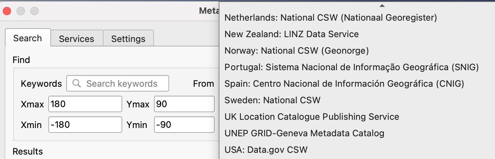

# Client access and development to interact with pygeoapi

Since pygeoapi provides standardised web services to data, a range of clients and software libraries are available to interact with web services provided by pygeoapi. In this paragraph we highlight some common client (libraries) and provide some exercises to try them out. The topic is split up by various client implementations.

## QGIS

### OGC API Features

QGIS is one of the first GIS Desktop clients which added support for OGC API Features. The support has been integrated into the WFS connection panel.

!!! question "Open an OGC API Features collection in QGIS"

    Follow the steps to add some collections from an OGC API Features enpoint: 

    - Open QGIS (if you don't have QGIS, you can use OSGEO Live). 
    - From the Layer menu, select `Add Layer` > `Add WFS layer`. 
    - From the `Data source manager` panel, choose 'New connection'. 
    
    { width=50% }
    
    - Add the URL https://demo.pygeoapi.io/master (or the address of a local server). 
    - You can now click the `detect` button and QGIS will notice you are configuring an OGC API Features endpoint. 
    - QGIS facilitates to set page size (request is split in multiple requests), for points you can easily set it to 2500, for certain polygons 100 can already be slow. 
    - Press `ok` to save the connection and return to the previous screen. 
    - Now click the `Connect` button to retireve the collections of the service. 
    
    { width=50% }
    
    - You can now add collections to your QGIS project. 
    - You can also build a query to add a subset of the collection.
    - Close the `Data source manager`. Notice that QGIS applied a default styling just like it would if you add a file based layer. You can work with the collection in a similar way; identify, apply styling, filter, export, etc.  


    
!!! tip

    Install and activate the `QGIS Network Logger` extension. It will display which web requests are fired on the backend, also a good tool to debug failing connections.

!!! note

    An increasing number of GIS Desktop clients add support for OGC API's in subsequent releases. For example ArcGIS Pro [supports OGC API Features](https://pro.arcgis.com/en/pro-app/2.8/help/data/services/use-ogc-api-services.htm) since release 2.8.

### OGC API Records

QGIS supports OGC API Records via the [Metasearch plugin](https://docs.qgis.org/latest/en/docs/user_manual/plugins/core_plugins/plugins_metasearch.html). Metasearch originally focussed on Web Catalgue Service (OGC:WCS) only, but has been extended to OGC API Records last year. Metasearch is a default plugin in QGIS (no installation required).

!!! question "Query OGC API Records from QGIS"

    Follow these steps to connect to a service and query datasets:
    
    - Locate the metasearch plugin in the web menu or on a toolbar (globe + binoculars). The main search panel opens with some popular catalogues pre-populated.

    { width=50% }

    - Open the `services` tab, to find the `new` button to create a new connection.  
    - Add a connection to `https://demo.pygeoapi.io/master`. 
    - Click `Serviceinfo` to get information about the service.
    - Return to the Search tab. 
    - Select the connection you have just created. 
    - type a search term and click `search`.
    - Notice that when you select a search result, a red box is drawn on the map highlighting the location of the dataset.

    { width=50% }

!!! note 

    In optimal cases Metasearch will locate a file or service link on the metadata and enable the `add data` button (like it does for CSW). Unfortunately the OGC group is still discussing how to implement this in the standard. OGC API Records is not final yet, so its functionality may be subject to change. 

## GDAL/OGR

[GDAL/OGR](https://gdal.org) provides mechanisms to interact with [OGC API Features](https://gdal.org/drivers/vector/oapif.html) as well as [OGC API Coverages](https://gdal.org/drivers/raster/ogcapi.html). It means you can use the popular client commands to interact with OGC API's; ogrinfo, gdalinfo, ogr2ogr, etc. Also you can make connections to OGC API's from any software which has an interface to gdal, such as Mapserver, GeoServer, Manifold, FME, ArcGIS, etc.

### OGC API Features

!!! question "Use OGR to interact with OGC API Features"

    - Verify you have a recent GDAL installed, else use GDAL from OSGEO Live.
    - Run OGRINFO on command line to verify a connection to OGC API Features

    ```
    ogrinfo OAPIF:https://demo.pygeoapi.io/master/collections/obs
    ```
    
    - Now, let's convert the observations into a shapefile

    ```
    ogr2ogr\
      -f "ESRI Shapefile" obs.shp\
      OAPIF:https://demo.pygeoapi.io/master/collections/obs
    ```

!!! Note

    You can even use OGR to append new features to an OGC API Features collection. However at this moment in time pygeoapi does not support transactions yet.


### OGC API Coverages

OGC API Coverages is still under development at OGC. The GDAL team however already implemented an experimental plugin to interact with OGC API Coverages (maps, tiles and processes).

!!! question "Use GDAL to interact with OGC API Coverages"

    - Verify you have a recent GDAL installed, else use GDAL from OSGEO Live.
    - Run GDALINFO on command line to verify a connection to OGC API Coverages:

    ```
    gdalinfo OGCAPI:https://maps.ecere.com/ogcapi/collections/SRTM_ViewFinderPanorama
    ```

## OWSLIB

- https://geopython.github.io/OWSLib/usage.html#ogc-api (+jupyter)

## OpenLayers

- https://github.com/openlayers/openlayers/issues/12387

!!! note

    [Leaflet](https://github.com/opengeospatial/ogcapi-features/blob/master/implementations/clients/leaflet.md)
    [ESRI](https://developers.arcgis.com/javascript/latest/api-reference/esri-layers-OGCFeatureLayer.html)


- https://openlayers.org/en/latest/examples/ogc-vector-tiles.html
- https://openlayers.org/en/latest/examples/ogc-map-tiles.html

!!! question "OGC API in Openlayers"

  - Add a ogc-api-tiles layer; 
  - Add a ogc-api-Features layer;


